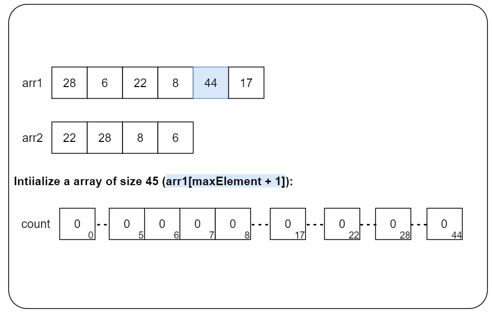
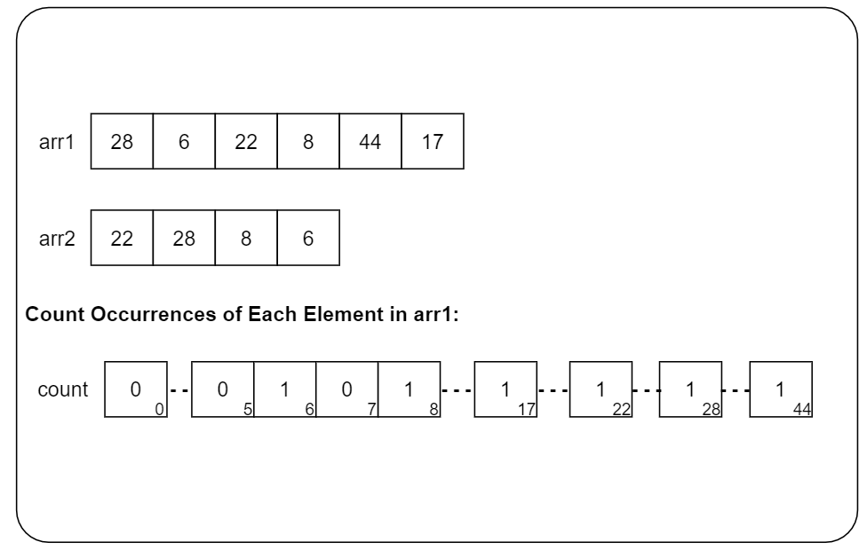
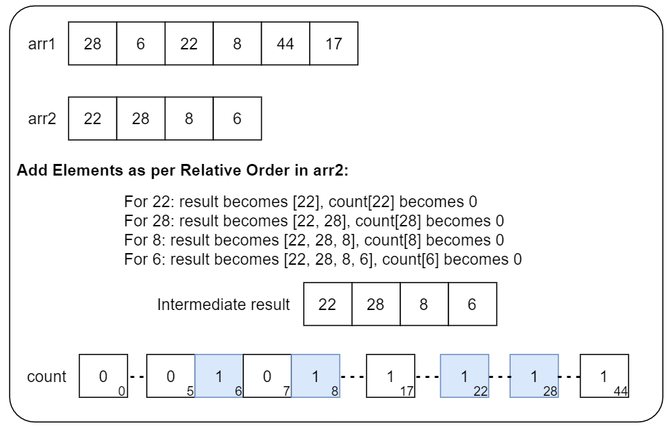
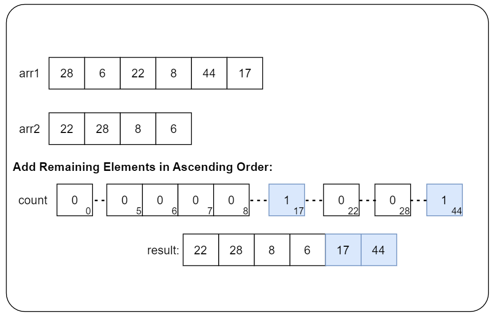

# 1122. Relative Sort Array

Given two arrays `arr1` and `arr2`, the elements of `arr2` are distinct, and all elements in `arr2` are also in `arr1`.

Sort the elements of `arr1` such that the relative ordering of items in `arr1` are the same as in `arr2`. Elements that do not appear in `arr2` should be placed at the end of `arr1` in **ascending** order.

**Example 1:**

> **Input:** arr1 = \[2,3,1,3,2,4,6,7,9,2,19\], arr2 = \[2,1,4,3,9,6\]
>
> **Output:** \[2,2,2,1,4,3,3,9,6,7,19\]

**Example 2:**

> **Input:** arr1 = \[28,6,22,8,44,17\], arr2 = \[22,28,8,6\]
>
**Output:** \[22,28,8,6,17,44\]

## Constraints

* `1 <= arr1.length, arr2.length <= 1000`
* `0 <= arr1[i], arr2[i] <= 1000`
* All the elements of `arr2` are **distinct**.
* Each `arr2[i]` is in `arr1`.

## Topics

* `Array`
* `Hash Table`
* `Sorting`
* `Counting Sort`

## Hints

1. Using a hashmap, we can map the values of arr2 to their position in arr2.

2. After, we can use a custom sorting function.

## Solution

### Approach 1: Using Two Loops and Sorting

#### Intuition

One way to solve this problem is to use nested loops to find the elements in `arr1` that are present in `arr2`, and then sort the remaining elements.

To start, we will create a new array `result` to store the sorted elements. The first step is to identify the elements present in both `arr1` and `arr2`. We iterate through `arr2` using a loop, and for each element in `arr2`, we check if the same element exists in `arr1`. If it does, we add that element to the result array and mark its position in `arr1` as -1 to avoid duplicates.

After this step, the result array will contain all the elements from `arr1` that were present in `arr2`, in the order they appeared in `arr2`. Now, we need to add the remaining elements from `arr1` that were not present in `arr2`. We sort the `arr1` array which brings all the unmarked elements (-1) to the left end of the array. Then, we iterate through `arr1` again and add all the non-negative elements to the result array.

After both steps, we return the result array, which now contains all the elements from `arr1` sorted according to the relative order specified by `arr2`, followed by the remaining elements in ascending order.

#### Algorithm

* Initialize an empty `result` array.
* Iterate through the relative order array (`arr2`).
  * For each element in `arr2`, iterate through the target array (`arr1`).
    * If the element in `arr1` matches the current element in `arr2`.
      * Add the element to the `result` array.
      * Mark the element in `arr1` as visited (-1).
* Sort the remaining elements in `arr1` (elements not marked as visited).
* Iterate through `arr1` again.
  * If the element is not marked as visited, add it to the `result` array.
* Return the `result` array.

#### Implementation

```python
class Solution:
    def relativeSortArray(self, arr1: List[int], arr2: List[int]) -> List[int]:
        result = []
        # Traverse through the relative order array
        for value in arr2:
            # Traverse through the target array
            for j in range(len(arr1)):
                # Element in target array matches with relative order element
                if arr1[j] == value:
                    # Add it to the result array
                    result.append(arr1[j])
                    # Mark the element in target array as visited
                    arr1[j] = -1
        # Sort the remaining elements in the target array
        arr1.sort()
        # Add the remaining elements to the result array
        for value in arr1:
            if value != -1:
                result.append(value)
        return result
```

#### Complexity Analysis

Let n be the size of `arr1` and m be the size of `arr2`.

* Time complexity: O(m⋅n+nlogn)

    We iterate through each element of `arr2` and for each element, we iterate through `arr1`. This results in O(m⋅n) time complexity.

    Sorting `arr1` has a time complexity of O(nlogn).

    Iterating through `arr1` to add non-marked elements to the result has a time complexity of O(n).

    Combining these steps, the overall time complexity is O(m⋅n+nlogn+n), which we can simplify to O(m⋅n+nlogn).

* Space complexity: O(n) or O(logn)

    Apart from the `result` array and a few variables, the algorithm doesn't use any additional data structures that scale with input size. We do not count `result` array in the space complexity as it's only used to store the output.

    Note that some extra space is used when we sort arrays in place. The space complexity of the sorting algorithm depends on the programming language.

  * In Python, the sort method sorts a list using the Timsort algorithm which is a combination of Merge Sort and Insertion Sort and has O(n) additional space.

* * *

### Approach 2: Using Hash Map for Counting and Sorting

#### Intuition

We can improve upon the first approach by using a map to store the elements from `arr2` and their frequencies in `arr1`. This eliminates the need for nested loops and reduces the time complexity to O(m+nlogn). Also, we can use a temporary array `remaining` to store the remaining elements, avoiding the need for sorting the entire `arr1`, further improving efficiency.

We will use a map to store the elements from `arr2` as keys and their frequencies in `arr1` as values. We will also create a temporary array `remaining` to store elements from `arr1` that are not present in `arr2`.

Then, we will iterate through `arr1` and update the frequencies in the map for elements present in `arr2`. If an element is not present in `arr2`, we will add it to the `remaining` array. After processing all elements from `arr1`, we sort the `remaining` array in ascending order.

Next, we create the final `result` array. We iterate through `arr2` and add each element to the result based on its frequency stored in the map. After processing all elements from `arr2`, we will add the elements from the `remaining` array to the `result`.

#### Algorithm

* Initialize an empty `result` array and an empty `remaining` array.
* Initialize an unordered map (`countMap`) with elements from `arr2` as keys and initial count as 0.
* Iterate through `arr1`.
  * If the element is present in `countMap` (i.e., present in `arr2`).
    * Increment the count in `countMap` for that element.
  * Else (element not present in `arr2`).
    * Add the element to the `remaining` array.
* Sort the `remaining` array.
* Iterate through `arr2`.
  * For each element in `arr2`.
    * Add the element to the `result` array, `countMap[element]` times.
* Iterate through the `remaining` array.
  * Add all elements from the `remaining` array to the `result` array.
* Return the `result` array.

#### Implementation

```python
class Solution:
    def relativeSortArray(self, arr1: List[int], arr2: List[int]) -> List[int]:
        count_map = {}
        remaining = []
        result = []
        # Initialize count map with relative order elements
        for value in arr2:
            count_map[value] = 0
        # Count occurrences of elements in target array
        for value in arr1:
            if value in count_map:
                count_map[value] += 1
            else:
                remaining.append(value)
        # Sort the remaining elements
        remaining.sort()
        # Add elements as per relative order
        for value in arr2:
            for _ in range(count_map[value]):
                result.append(value)
        # Add remaining elements
        result.extend(remaining)
        return result
```

#### Complexity Analysis

Let n be the size of `arr1` and m be the size of `arr2`.

* Time complexity: O(m+nlogn)

    Initializing the map with elements from `arr2` takes O(m) time.

    Counting occurrences of elements in `arr1` and updating the map or adding to the `remaining` array takes O(n) time.

    Sorting the `remaining` array takes O(nlogn) time.

    Adding elements to the `result` array based on the map and the relative order of `arr2` takes O(n) time.

    Adding the sorted remaining elements to the result list takes O(n) time.

    Combining these steps, the overall time complexity is O(m+n+nlogn+n), which we can simplify to O(m+nlogn).

* Space complexity: O(n+m)

    We use an unordered map to store the frequencies of elements in `arr2`. Since `arr2` has `m` unique elements, the space required is O(m).

    We store elements from `arr1` that are not present in `arr2`. In the worst case, all `n` elements of `arr1` are unique and not in `arr2`, requiring O(n) space.

    Additionally some extra space is used when we sort arrays in place. The space complexity of the sorting algorithm depends on the programming language.

  * In Python, the sort method sorts a list using the Timsort algorithm which is a combination of Merge Sort and Insertion Sort and has O(n) additional space.

    Therefore, the overall space complexity depends on the language used for sorting:  
    Python: O(n+m)  

* * *

### Approach 3: Using Counting Sort

#### Intuition

In Approach 2, we used an unordered map to store the elements from `arr2` as keys and their frequencies in `arr1` as values. In this approach, we can use an array `count` to store the frequencies of elements in `arr1`. This is more memory-efficient than using an unordered map, as the elements in `arr1` are guaranteed to be in the range of 0 to 1000.

We will find the maximum element in `arr1` and use an array `count` of size `maxElement + 1` to store the frequencies of elements in `arr1`. We iterate through `arr1` and update the frequencies in the `count` array.

Next, we create the final result array. Then, we iterate through `arr2`, and for each element in `arr2`, we add it to the result as many times as its frequency in `count[element]`. We decrement `count[element]` after each addition to keep accurate track of the elements we still need to add.

After processing all elements from `arr2`, we iterate through the remaining elements in the `count` array. For each index `num` where `count[num]` is non-zero, we add the element `num` to the result as many times as its frequency (`count[num]`).

Finally, we return the result array, which now contains all the elements from the original `arr1`, sorted according to the relative order specified by `arr2`, followed by the remaining elements in ascending order.

The approach is visualized below:






#### Algorithm

* Find the `maxElement` in `arr1`.
* Initialize a `count` array of size `maxElement + 1` to store the count of occurrences of each element.
* Iterate through `arr1`.
  * Increment the count in the `count` array for each element.
* Initialize an empty `result` array.
* Iterate through `arr2`.
  * For each element in `arr2`.
    * Add the element to the `result` array, `count[element]` times.
    * Decrement the count in the `count` array for that element.
* Iterate from 0 to `maxElement`.
  * For each index `i`.
    * Add the element i to the `result` array, `count[i]` times.
* Return the `result` array.

#### Implementation

```python
class Solution:
    def relativeSortArray(self, arr1: List[int], arr2: List[int]) -> List[int]:
        max_element = max(arr1)
        count = [0] * (max_element + 1)

        # Count occurrences of each element
        for element in arr1:
            count[element] += 1

        # Add elements as per relative order
        result = []
        for value in arr2:
            while count[value] > 0:
                result.append(value)
                count[value] -= 1

        # Add remaining elements in ascending order
        for num in range(max_element + 1):
            while count[num] > 0:
                result.append(num)
                count[num] -= 1

        return result
```

#### Complexity Analysis

Let n be the size of `arr1` and m be the size of `arr2`. Let k be the maximum element in `arr1`.

* Time complexity: O(n+m+k)

    Finding the maximum element in `arr1` takes O(n) time.

    Counting occurrences of each element in `arr1` using the count array takes O(n) time.

    Adding elements to the `result` array based on the relative order of arr2 takes O(m+n) time.

    Iterating through the count array to add remaining elements to the `result` array takes O(n+k) time.

    Combining these steps, the overall time complexity is O(n+n+m+n+k)\=O(n+m+k).

* Space complexity: O(k)

    The count array has a size of `maxElement + 1`, resulting in O(k) space, where k is the maximum element in `arr1`.

* * *
