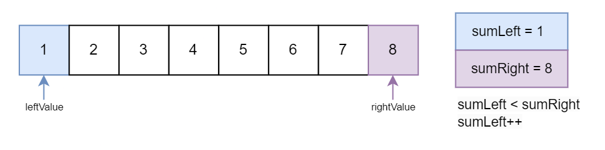
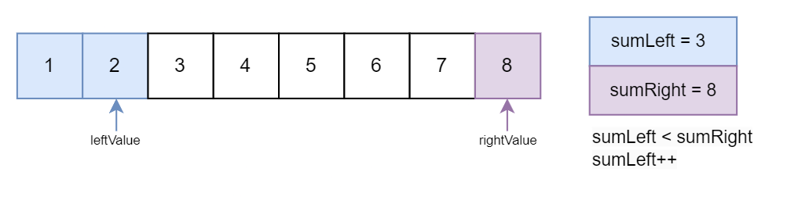
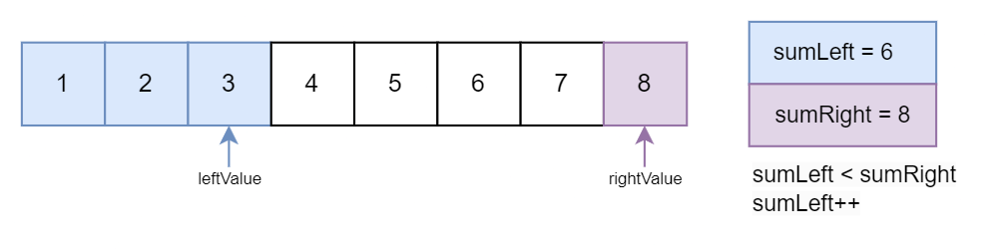
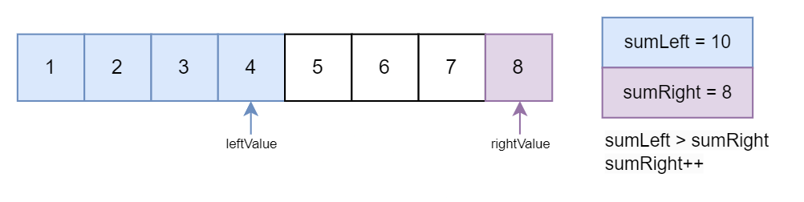
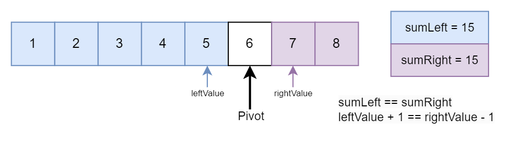
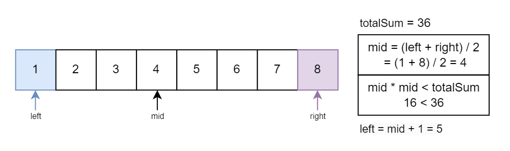
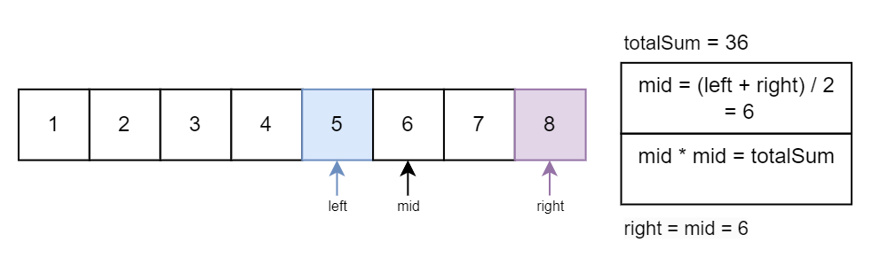

# 2485. Find the Pivot Integer

Given a positive integer `n`, find the **pivot integer** `x` such that:

* The sum of all elements between `1` and `x` inclusively equals the sum of all elements between `x` and `n` inclusively.

Return _the pivot integer_ `x`. If no such integer exists, return `-1`. It is guaranteed that there will be at most one pivot index for the given input.

**Example 1:**

> **Input:** n = 8
>
> **Output:** 6
>
> **Explanation:** 6 is the pivot integer since: 1 + 2 + 3 + 4 + 5 + 6 = 6 + 7 + 8 = 21.

**Example 2:**

> **Input:** n = 1
>
> **Output:** 1
>
> **Explanation:** 1 is the pivot integer since: 1 = 1.

**Example 3:**

> **Input:** n = 4
>
> **Output:** -1
>
> **Explanation:** It can be proved that no such integer exist.

## Constraints

* `1 <= n <= 1000`

## Topics

* `Math`
* `Prefix Sum`

## Hints

1. Can you use brute force to check every number from 1 to n if any of them is the pivot integer?
2. If you know the sum of \[1: pivot\], how can you efficiently calculate the sum of the other parts?

## Solution

### Overview

We need to find a pivot integer `x` in a range from 1 to a positive integer `n` such that the sum of all elements from 1 to `x` is equal to the sum of all elements from `x` to `n`. If such an integer exists, it should be returned; otherwise, -1 should be returned.

**Key Observations:**

1. All numbers in the range are positive.
2. The pivot is the point in the sequence where the sum on both sides is equal.
3. The pivot integer is included in the sum of both halves.

Consider the given example `n = 8`:

For `x` to be a pivot integer, the sum of elements from 1 to `x` should be equal to the sum from `x` to `n`.

\[1 + 2 + 3 + 4 + 5 + 6 = 21\] and \[6 + 7 + 8 = 21\].

The pivot integer `x` for this example is 6, as the sum of elements from 1 to 6 is equal to the sum of elements from 6 to 8.

* * *

### Approach 1: Brute Force

#### Intuition

We can perform multiple iterations, checking each potential pivot value from 1 to `n`. During this iteration, for each pivot value `i`, we use nested loops to separately calculate the sum of elements on the left side of the pivot and the right side. The first nested loop iterates from 1 to `i`, summing up elements on the left side.

The second nested loop iterates from `i` to `n`, summing up elements on the right side. After calculating the left and right sums, we can check if they are equal. If yes, it implies that the pivot integer `x` has been found. Return the pivot value or -1 if no valid pivot exists.

#### Algorithm

* Iterate through possible pivot values from 1 to `n`.
* For each pivot value, initialize variables `sumLeft` and `sumRight` to 0.
  * Then, calculate the sum of elements on the left side of the pivot by iterating from 1 to the pivot value and adding each element to `sumLeft`.
  * Next, calculate the sum of elements on the right side of the pivot by iterating from the pivot value to `n` and adding each element to `sumRight`.
  * After calculating the left and right sums, check if they are equal. If they are, return the pivot value.
* If no pivot is found after iterating through all possible values, return -1.

#### Implementation

```python
class Solution:
    def pivotInteger(self, n: int) -> int:
        # Iterate through possible pivot values
        for i in range(1, n + 1):
            # Calculate the sum of elements on the left side of the pivot
            sum_left = sum(range(1, i + 1)) 
            # Calculate the sum of elements on the right side of the pivot
            sum_right = sum(range(i, n + 1)) 

            # Check if the sums on both sides are equal
            if sum_left == sum_right:
                return i  # Return the pivot value if found

        return -1  # Return -1 if no pivot is found
```

#### Complexity Analysis

Let n be the length of the sequence from 1 to N.

* Time complexity: O(n2)

    The time complexity is O(n2) due to the nested loops that iterate through potential pivot values and calculate sums on both sides.

* Space complexity: O(1)

    The space complexity is O(1) since the memory usage remains constant regardless of the input size. Only a few variables are used to store sums.

### Approach 2: Two Pointer

#### Intuition

In the previous brute-force approach, we used nested loops to find the pivot value, which is inefficient.

Now, consider a more optimized approach. Instead of iterating over potential pivots first, we directly calculate `sumLeft` and `sumRight` while traversing the range. We start with pointers at both ends (`leftValue` and `rightValue`) and dynamically adjust the sums as the pointers move towards the center. By doing so, we maintain the sums in real time without the need for an additional nested loop.

We traverse the range until the pointers meet, dynamically adjusting sums based on comparisons. If `sumLeft` is greater than or equal to `sumRight`, the sum on the left is ahead, and we must catch up on the right. Hence, we decrement `rightValue` and add the new element to `sumRight`. Otherwise, the sum on the right is ahead, so we increment `leftValue` and add the new element to `sumLeft`.

Within the loop, we check for a valid pivot. If the sums are equal and the pointers are close enough, we have identified a valid pivot, i.e., `sumLeft == sumRight && leftValue + 1 == rightValue - 1`.

Refer to the visual slideshow demonstrating the two pointer approach:








#### Algorithm

* Initialize `leftValue` and `rightValue` to 1 and `n`, respectively, and `sumLeft` and `sumRight` to `leftValue` and `rightValue`, respectively.
* If `n` is 1, return `n` as it is already a valid pivot.
* Enter a while loop that continues while `leftValue` is less than `rightValue`.
  * Check if `sumLeft` is less than `sumRight`. If true, increment `leftValue` by 1 and add the new value to `sumLeft`.
  * If false, decrement `rightValue` by 1 and add the new value to `sumRight`.
  * After adjusting the pointers and sums, check if `sumLeft` is equal to `sumRight` and if the pointers are next to each other (`leftValue + 1 == rightValue - 1`). If this condition is met, it means that `leftValue + 1` is a valid pivot; thus, return this value.
* If the loop exits without finding a pivot, return -1 to indicate that no valid pivot was found.

#### Implementation

```python
class Solution:
    def pivotInteger(self, n: int) -> int:
        left_value = 1
        right_value = n
        sum_left = left_value
        sum_right = right_value

        if n == 1:
            return n

        # Iterate until the pointers meet
        while left_value < right_value:
            # Adjust sums and pointers based on comparison
            if sum_left < sum_right:
                sum_left += left_value + 1
                left_value += 1
            else:
                sum_right += right_value - 1
                right_value -= 1

            # Check for pivot condition
            if sum_left == sum_right and left_value + 1 == right_value - 1:
                return left_value + 1

        return -1  # Return -1 if no pivot is found
```

#### Complexity Analysis

Let n be the length of the sequence from 1 to N.

* Time complexity: O(n)

    The time complexity is O(n) due to the loop that iterates through potential pivot values to calculate sums on both sides.

* Space complexity: O(1)

    The space complexity is O(1) since the memory usage remains constant regardless of the input size. Only a few variables are used to store sums.

### Approach 3: Binary Search

#### Intuition

To optimize the solution further, we can use the efficiency of [binary search](https://leetcode.com/explore/learn/card/binary-search/) and the [arithmetic progression sum formula](https://en.wikipedia.org/wiki/Arithmetic_progression). Using the arithmetic progression sum formula, we can determine the total sum of the entire series.

In this optimization, we perform a check using the expression `mid * mid - totalSum = 0`. If the result is zero, it implies that the current midpoint is the pivot we are searching for. This is because the quadratic relationship x2 in the cumulative sum means that the pivot is the point where the cumulative sum reaches half of the total sum.

Total Sum: 36
Pivot: 6  
$6 \cdot 6=36$

|1|2|3|4|5|6|7|8|
|-|-|-|-|-|-|-|-|
|1|2|3|4|5|3+3|7|8|

The sum to the left of the pivot is 15, and the sum to the right of the pivot is 15. Half of the pivot is 3, which makes each half of the sum 18. $\frac{36}{2}=18$

We exploit the monotonically increasing nature of the sequence from 1 to `n`. The goal is to find the pivot point, which is the integer where the sum of all integers from 1 to that integer equals the sum of the remaining integers from the pivot point to `n`.

The total sum of the sequence can be calculated using the formula $\frac{n \cdot (n+1)}{2}$ (Arithmetic progression sum formula), which is equivalent to $\frac{n^2+n}{2}$

The main criterion in the binary search is to continually adjust the search space by comparing the midpoint with the total sum. The midpoint divides the search space into two halves. It is squared (`mid * mid`) and then compared against the total sum. The choice of squaring the midpoint is intentional and aligns with the nature of the sum formula, which involves squaring the number n in the formula $\frac{n \cdot (n+1)}{2}$.

The function $f(x) = x \cdot x$ represents a monotonic increasing function for non-negative values of `x`. If the square of mid is less than the total sum, it indicates that the cumulative sum is increasing, suggesting that the pivot point hasn't been reached yet.

Refer to the visual slideshow demonstrating the binary search approach:





#### Algorithm

* Initialize the `left` pointer to `1` and the `right` pointer to `n` for binary search.
* Calculate the `totalSum` of the sequence using the formula n⋅(n+1)/2.
* Perform a binary search by adjusting the `left` and `right` bounds based on the difference between the square of the `mid` and the `totalSum` until the left pointer is equal to the right pointer.
  * If the difference is negative, this implies that the pivot point must be to the right of the midpoint because the sum of integers increases as you move to the right. In this case, the left bound (`left`) is adjusted to `mid + 1`, narrowing the search range to the right side.
  * If the difference is positive (or equal to 0), this implies that the pivot point must be to the left of the midpoint or possibly at the midpoint itself. In this case, the right bound (`right`) is adjusted to `mid`, narrowing the search range to the left side or keeping the midpoint as a potential solution.
* Check if the square of the left pointer minus the `totalSum` is zero, if yes, it means that the left pointer is pointing to the pivot point, as the sum of integers on one side of the pivot is equal to the sum on the other side; otherwise, return -1.

#### Implementation

```python
class Solution:
    def pivotInteger(self, n: int) -> int:
        # Initialize left and right pointers for binary search
        left, right = 1, n
        
        # Calculate the total sum of the sequence
        total_sum = n * (n + 1) // 2

        # Binary search for the pivot point
        while left < right:
            # Calculate the mid-point
            mid = (left + right) // 2

            # Check if the difference between the square of mid and the total sum is negative
            if mid * mid - total_sum < 0:
                left = mid + 1  # Adjust the left bound if the sum is smaller
            else:
                right = mid  # Adjust the right bound if the sum is equal or greater

        # Check if the square of the left pointer minus the total sum is zero
        if left * left - total_sum == 0:
            return left
        else:
            return -1
```

#### Complexity Analysis

Let n be the length of the sequence from 1 to n.

* Time complexity: O(logn)

    The binary search efficiently narrows down the search space by half in each iteration, leading to a logarithmic time complexity. Other operations, such as calculating the total sum, squaring values, and performing arithmetic operations, have constant time complexity.

* Space complexity: O(1)

    The algorithm uses a constant amount of extra space, as the number of variables remains the same regardless of the input size.

* * *

### Approach 4: Pre-Compute and Cache in a Lookup Table

#### Intuition

As the input size `n` increases, the pivot integer `x` tends to increase, where `x` is the sum of elements from 1 to `x` equaling the sum of elements from `x` to `n`.

To optimize the process, a precomputation strategy can be used, involving the calculation and storage of pivot values for all possible `n` in an array called `precompute`. This precomputation involves calculating the pivot for each `n` in the range.

After the precomputation, when a specific `n` is given as a query, the precomputed pivot value can be directly retrieved from the `precompute` array. This retrieval operation takes constant time, as it merely involves indexing an array.

We will define the `precompute` array globally as it offers a practical advantage in our code. If we define the precompute array globally, it won't be recomputed each time the function is called in the context of a larger program. A global variable retains its state across different function calls. So, by defining the precompute array globally, we ensure that its values persist throughout the execution of the program, including across multiple test cases. This can significantly improve efficiency, especially when the precompute array involves time-consuming calculations that don't need to be repeated for each test case.

This approach is practical when handling multiple queries involving different `n` values. It's more efficient because it doesn't redo the pivot calculation every time. But there's a downside—the first setup takes some time, O(n) where `n` is the maximum `n` value. This approach is less efficient when the pivot is needed for only a few `n` values or when memory is limited.

Despite these considerations, the benefits of this approach become more pronounced in real-world applications where the system deals with diverse and larger datasets. The time it takes to set up might not be as noticeable in the long run, and the benefits of using it become more obvious in larger, practical projects. For example, if you have a big pile of papers and you want to organize them by size, using this method makes the process faster once you've set it up.

> Traditional dynamic programming involves reusing intermediate results (e.g., `DP[y]` based on `DP[x]` where `x` is smaller than `y`). However, this approach focuses on pre-computing and storing values for efficient retrieval, so it is considered pre-computation and storage in a lookup table rather than dynamic programming.

#### Algorithm

* Initialize the variable `maxValue` to 1000, the maximum `n` value provided by the constraints.
* Initialize an array `precompute` of size `maxValue + 1` filled with 0 to store precomputed pivot values.
* Check if the `precompute` array is not initialized. If not initialized, iterate from 1 to `maxValue`.
  * Calculate the `sum` of integers up to `i` using the formula i∗(i+1)/2.
  * Find the first square number greater than or equal to the `sum` by incrementing `j` until `j * j` is greater than or equal to the `sum`.
  * Check if `j * j` is equal to the `sum`. If true, it means that the current value of `j` is the pivot for the given `i`. Otherwise, set `precompute[i]` to `-1`, indicating that no pivot is found for the current `i`.
* Return the pivot value for the input `n` from the `precompute` array.

#### Implementation

```python
class Solution:
    maxValue = 1000
    # Array to store precomputed pivot values
    precompute = [0] * (maxValue + 1) # Initializing to 0

    def pivotInteger(self, n: int) -> int:
        # Check if precompute array is not initialized
        if self.precompute[1] == 0:
            for i in range(1, self.maxValue + 1):
                sum_val = i * (i + 1) // 2

                j = 1
                # Find the first square greater than or equal to sum
                while j * j < sum_val:
                    j += 1

                # Check if j * j is equal to sum (pivot found), otherwise set to -1
                self.precompute[i] = j if j * j == sum_val else -1

        return self.precompute[n]
```

#### Complexity Analysis

Let m be the maximum precomputed n value.

* Time complexity: O(m)

    While the time complexity for individual queries is O(1), the overall complexity is influenced by the precomputation, making it O(m).

* Space complexity: O(m)

    The space complexity is influenced by the precomputation step, which requires storing an array of size `m`. Therefore, the space complexity is O(m) .

* * *

### Approach 5: Using Math

#### Intuition

To find the value of `x` where the sum of elements from 1 to `x` is equal to the sum of elements from `x` to `n`, we can set up the following equation:

$[1+2+...+x=x+...+n]$

Using Arithmetic Progression:

$[\frac{x\cdot(x+1)}{2}=\frac{(x+n)\cdot(n−x+1)}{2}​]$

Expanding both sides of the equation:

$[\frac{x+x^2}{2}​=\frac{n \cdot x − x^2+x+n^2−n \cdot x+n}{2}]$

Simplifying the equation and solving for x:

$[2 \cdot x^2=n^2+n]$

$[x = \sqrt{\frac{n^2+n}{2}​}​$

This formula provides the value of `x` that satisfies the given condition for the sum of elements in an arithmetic progression. It ensures that the sum of elements from 1 to `x` is equal to the sum of elements from `x` to `n`.

#### Algorithm

* Calculate the total `sum` of the sequence from 1 to `n` using the formula (n⋅(n+1)/2), which is equivalent to (n2+n)/2
* Calculate the square root of the total `sum` and store it in `pivot`.
* Check if the square of the `pivot` is equal to the total `sum`.
  * If the square of the `pivot` is equal to the total `sum`, return the `pivot` as the pivot integer `x`.
  * If the square of the `pivot` is not equal to the total `sum`, return `-1`.

#### Implementation

```python
class Solution:
  def pivotInteger(self, n: int) -> int:
        summ = (n * (n + 1) // 2)
        pivot = int(math.sqrt(summ))
        # If pivot * pivot is equal to sum (pivot found) return pivot, else return -1
        return pivot if pivot * pivot == summ else -1
```

#### Complexity Analysis

* Time complexity: O(1)

    The time complexity is constant, because the primary operation, the calculation of the square root (`sqrt(sum)`), takes a constant amount of time and is not dependent on the input size `n`.

* Space complexity: O(1)

    The space complexity is also constant, as the code uses only a fixed amount of additional space. The variables `sum` and `pivot` are constants and do not scale with the input size.

**Further Thoughts on Space Complexity:**

Since the input size (in terms of bits) is bounded by a constant multiple of  logn, and Newton's method has a time complexity of O( logn), the overall complexity of finding the square root using Newton's method can be considered O(1) for practical inputs. This is because the number of iterations required by Newton's method remains constant for inputs of bounded size. Therefore, for small inputs like the ones typically encountered in practice or like this question, the time complexity of finding the square root can be treated as constant. For inputs with unbounded bounds, the time complexity remains O( logn).

Let's perform a dry run for both `n=8` and `n=1000` to determine the exact number of iterations Newton's method requires:

1. **For n\=8**:

    * The sum is sum\=8×(8+1)/2\=36.

    * Since 36​\=6, a reasonable initial guess for the square root is 6, which is already a good approximation.

    * Let's run Newton's method:

        Iteration 1: x1​\=21​(6+636​)\=21​(6+6)\=6

    * The approximation doesn't change significantly because it's already accurate to a satisfactory precision. Therefore, only 1 iteration is required.

2. **For n\=1000**:

    * The sum is sum\=1000×(1000+1)/2\=500500.

    * For a rough initial guess, we can take the square root of the sum or a nearby integer value. Let's use 700 as a starting point since it's close to 500500​ and likely to converge quickly.

    * Let's run Newton's method:

        Iteration 1: x1​\=21​(700+700500500​)≈21​(700+715)≈707.5

        Iteration 2: x2​\=21​(707.5+707.5500500​)≈21​(707.5+707.11)≈707.305

        Iteration 3: x3​\=21​(707.305+707.305500500​)≈21​(707.305+707.13)≈707.217

        Iteration 4: x4​\=21​(707.217+707.217500500​)≈21​(707.217+707.127)≈707.172

        Iteration 5: x5​\=21​(707.172+707.172500500​)≈21​(707.172+707.165)≈707.169

        Iteration 6: x6​\=21​(707.169+707.169500500​)≈21​(707.169+707.168)≈707.169

    * The approximation stabilizes at around x\=707.169, and further iterations do not significantly change the result. Therefore, 6 iterations are required to converge to a satisfactory result.

    * These estimates that we took are just rough approximations, but they demonstrate that even for significantly different input sizes, the number of iterations required remains relatively small and can be considered constant for practical purposes. For fun you can experiment different rough estimates like maybe the furthest square root thats possible and you will still see the numbers are relatively constant. We strongly recommend checking out this blog on [analysis of binary search to find square root](https://math.stackexchange.com/questions/3665749/analysis-of-binary-search-to-find-square-root-versus-newtons-method-for-example). Many individuals, including those with a background in mathematics or those who have taken certain entrance exams, may have unknowingly utilized Newton's method for finding square roots to obtain the nearest answer from a set of math options.

    * All of the above in-depth reasons are why we have designated the space complexity as O(1) and considered this approach the most optimal.
