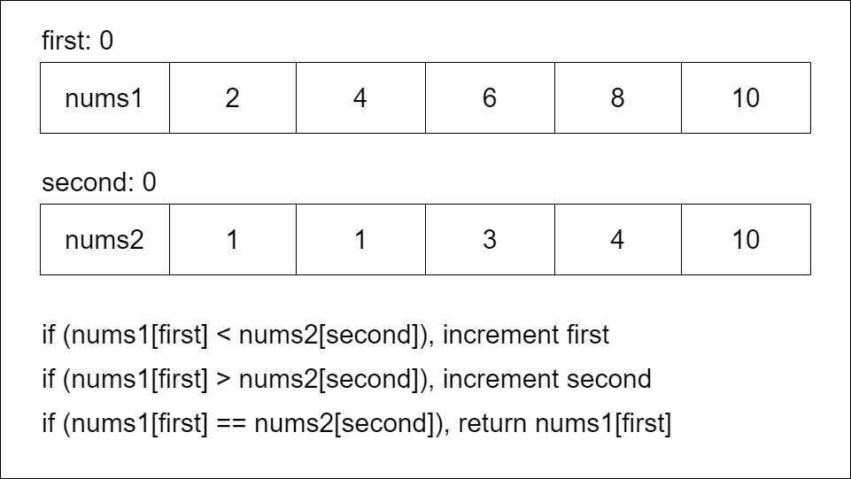
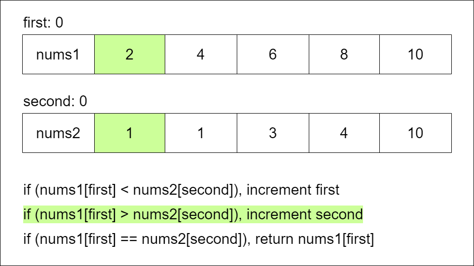
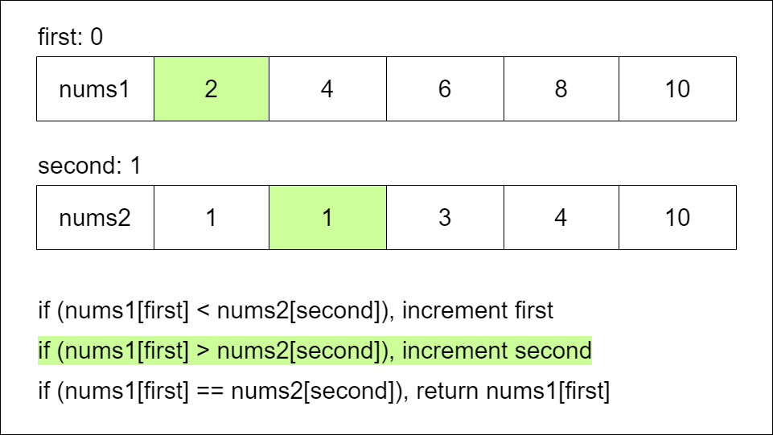
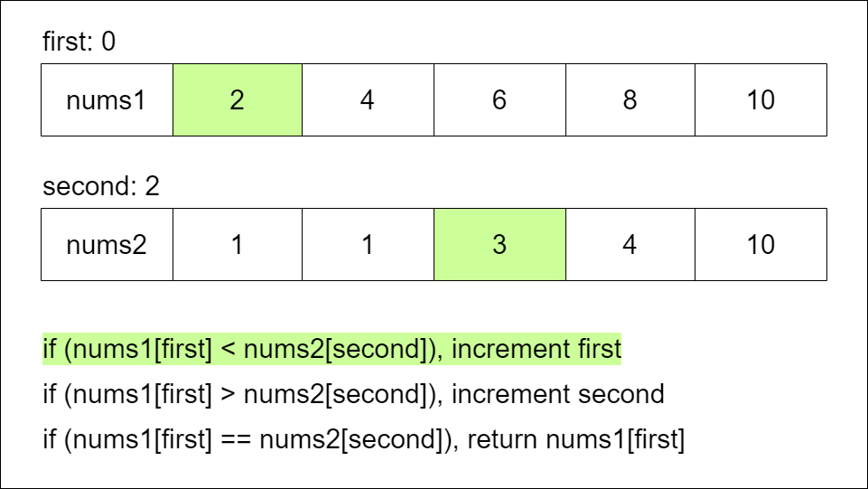
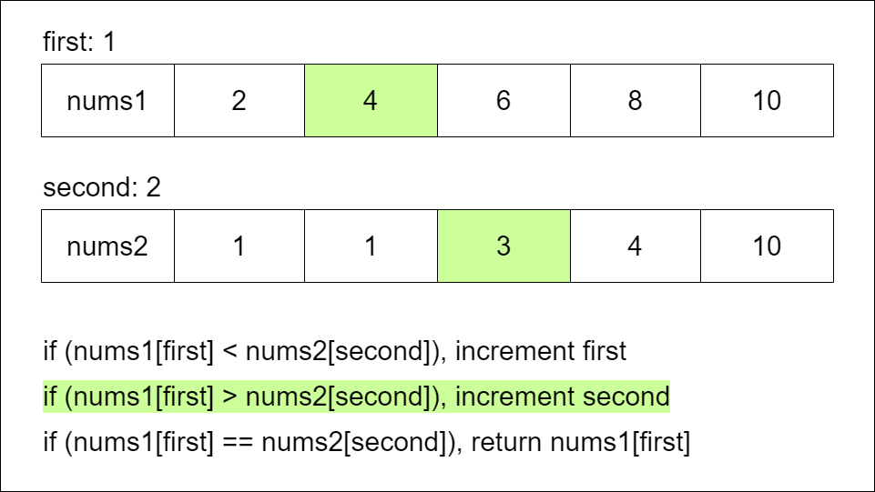
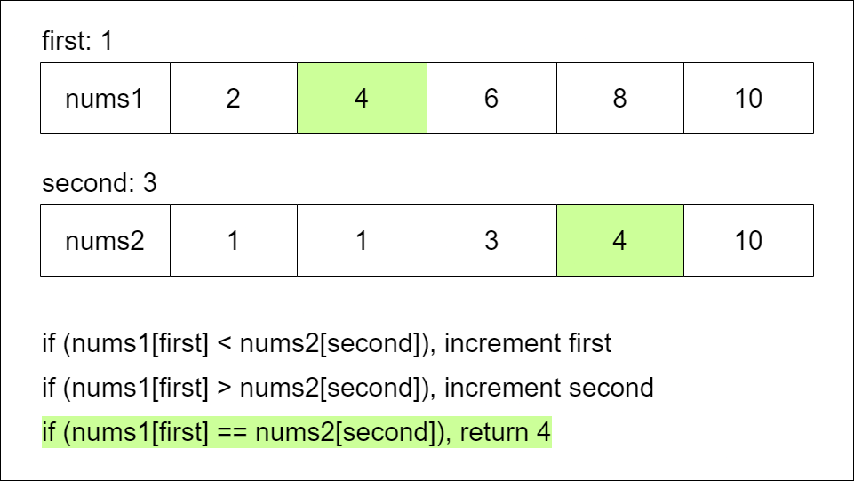

# 2540. Minimum Common Value

Given two integer arrays `nums1` and `nums2`, sorted in non-decreasing order, return _the **minimum integer common** to both arrays_. If there is no common integer amongst `nums1` and `nums2`, return `-1`.

Note that an integer is said to be **common** to `nums1` and `nums2` if both arrays have **at least one** occurrence of that integer.

**Example 1:**

> **Input:** nums1 = \[1,2,3\], nums2 = \[2,4\]
>
> **Output:** 2
>
> **Explanation:** The smallest element common to both arrays is 2, so we return 2.

**Example 2:**

> **Input:** nums1 = \[1,2,3,6\], nums2 = \[2,3,4,5\]
>
> **Output:** 2
>
> **Explanation:** There are two common elements in the array 2 and 3 out of which 2 is the smallest, so 2 is returned.

## Constraints

* `1 <= nums1.length, nums2.length <= 105`
* `1 <= nums1[i], nums2[j] <= 109`
* Both `nums1` and `nums2` are sorted in **non-decreasing** order.

## Topics

* `Array`
* `Hash Table`
* `Two Pointers`
* `Binary Search`

## Hints

1. Try to use a set.
2. Otherwise, try to use a two-pointer approach.

## Solution

### Overview

Given the arrays `nums1` and `nums2`, we aim to find the minimum integer common to both arrays. `nums1` and `nums2` are both sorted in increasing order. If there is no common integer, return `-1`.

A common value between two arrays appears in both arrays at least once.

* * *

### Approach 1: Hash Set

#### Intuition

The brute force approach to solving this problem would be to use nested loops to iterate through each number in each array, searching for common values, and then calculate the minimum of the common values. Nested loops are inefficient. It would be helpful if, instead of searching through an array to find a value, we could look up an element in constant time. Hash tables are a data structure that facilitate constant time lookups.

There are two main kinds of hash tables: hash maps, which store (key, value) pairs, and hash sets, which store unique values. For this problem, we chose a hash set because we are concerned with whether an element exists, not the number of times it occurs. A hashmap could alternatively be used to solve this problem, where the element is the key and the frequency is the value.

We can add the elements in `nums1` to a hash set `set1`, where the element is the key.

Then, we can loop through `nums2`, and check whether each element is in `set1`. Since `nums2` is in sorted order, the first common element we find is the minimum common element.

#### Algorithm

1. Initialize a set `set1` and add the elements from `nums1`.
2. For each `num` in `nums2`:
    * If `num` is in `set1`, return `num`. We found a common element. Since `nums2` is sorted in ascending order, the first common element is the minimum common element.
3. Return `-1` if there are no common elements.

#### Implementation

```python
class Solution:
    def getCommon(self, nums1: List[int], nums2: List[int]) -> int:
        # Add the elements from nums1 to set1
        set1 = set(nums1)

        # Search for each element of nums2 in set1
        # Return the first common element found
        for num in nums2:
            if num in set1:
                return num

        # Return -1 if there are no common elements
        return -1
```

#### Complexity Analysis

Let n be the length of `nums1` and m be the length of `nums2.`

* Time complexity: $O(n+m)$

    Creating `set1` takes $O(n)$.

    We search for each element of `nums2` in `set1`. Searching for an element in a hash set takes $O(1)$ on average, so the time complexity of this step is $O(m)$.

    The total time complexity will be $O(n+m)$.

* Space complexity: $O(n)$

    We initialize the set `set1`, which is size $O(e)$ where e is the number of distinct elements in `nums1`. At worst, there can be n distinct elements, so the space complexity is $O(n)$.

##### Set Intersection

Note that given two sets, their intersection is all of their common elements. Another approach to solving this problem would be to create sets out of `nums1` and `nums2`, then find the minimum value of the intersection. Below is the Python3 code for this approach. This approach is less straightforward for languages that do not have built-in set functions and requires more space than the other approaches without an improvement in time complexity, so it is not discussed in depth.

* * *

### Approach 2: Two Pointers

#### Intuition

Our objective is to find the minimum common value between two arrays. As discussed previously, the brute force approach would be to iterate through both arrays, searching for common values. This approach would be inefficient, with a time complexity of $O(n⋅m)$.

Can we develop a more efficient approach without using extra space?

Let's look at some examples to develop a strategy.

What patterns can we deduce from examining these examples?

Notice that since the arrays are sorted, and our objective is to find the minimum common value, the first common value we find when traversing both arrays left to right is the minimum common value.

We can leverage this fact to develop an efficient solution.

We can use two pointers to traverse both arrays simultaneously without a nested loop.

`first` will indicate the position in `nums1`, and `second` will indicate the position in `nums2`.

During each iteration, we compare the values of `nums1[first]` and `nums2[second]`. There are three possibilities.

1. The elements are equal. We have found a common value, and we return it.

2. `nums1[first] < nums2[second]`. Because `nums2` is sorted, every element after `second` will also be greater than `nums1[first]`. However, there is a chance that an element in `nums1` after `first` will be equal to `nums2[second]`. Thus, we should increment `first`.

3. `nums1[first] > nums2[second]`. The logic works the other way visa versa. We should increment `second`.

By traversing the arrays in this manner, we will find the first common value, if it exists.

> How do we know this approach will consistently provide the correct solution?
>
> We always increment the pointer which points to the lower value. This means we will process all the elements from both arrays in ascending order.
>
> Our algorithm stops in three cases:
>
> 1. A common element is found: it must be the minimum common value because elements are processed in order.
>
> 2. Both pointers reach the end of their array: all elements were checked, and there were no common values.
>
> 3. One pointer reaches the end of its array, and the element it points to is less than the current element in the other array: all remaining elements in the other array are larger than this element, so there are no common elements.
>

Below is a visualization of this algorithm:








#### Algorithm

1. Initialize two variables: `first`, which will store the position in `nums1`, and `second`, which will store the position in `nums2` to `0`, the starting index.
2. Iterate through `nums1` and `nums2` while `first` is less than the size of `nums1` and `second` is less than the size of `nums2`:
    * If `nums1[first]` is less than `nums2[second]`, increment `first` by `1` because we need a larger value from `nums1` to match the value at `nums2[second]`.
    * If `nums1[first]` is greater than `nums2[second]`, increment `second` by `1` because we need a larger value from `nums2` to match the value at `nums1[first]`.
    * Otherwise, `nums1[first]` must equal `nums2[second]`, so return the value of `nums1[first]`. We have found the minimum common value.
3. Return `-1` if the loop completes without returning an answer. This means there is no common value between `nums1` and `nums2`.

#### Implementation

```python

```

#### Complexity Analysis

Let n be the length of `nums1` and m be the length of `nums2`.

* Time complexity: $O(n+m)$

    We iterate through `nums1` and `nums2` using two pointers. On each iteration of the loop, one of the pointers is incremented, but not both. Each pointer can be incremented as many times as n or m, respectively, meaning we will iterate at most n+m times. With each iteration, we performed $O(1)$ work. Therefore, the time complexity is $O(n+m)$.

* Space complexity: $O(1)$

    We use a couple of variables and no additional data structures that grow with input size, so the space complexity is constant, $O(1)$.

### Approach 3: Binary Search

#### Intuition

To solve this problem, we need to search for common values between two arrays. The arrays are sorted, which means we can utilize binary search.

> Binary search is a search algorithm that finds the position of a target value within a sorted array.

Binary search uses three pointers. We can call them `left`, `mid`, and `right`.

Initially, `left` points to the first index of the array and `right` points to the last. At each step, we calculate `mid` as the middle element between `left` and `right`.

Binary search compares the target value with the middle element at each iteration.

* If the target value is equal to the middle element, the target has been found.

* If the target value is less than the middle element, continue to search in the left half.

* If the target value is greater than the middle element, continue to search in the right half.

With every iteration, the search window is divided in half, and the search is continued in either the right or the left side until either the target is found or `left` becomes greater than `right`.

We can solve the problem by iterating through each element in `nums1`, and using binary search to find that element in `nums2`. We want to perform binary search on the longer array, which will make the algorithm more efficient, so if `nums1` is longer, we swap the arrays.

#### Algorithm

##### Implementation Note

`mid`, the middle of the subarray, is set to the index in the middle of the array. The basic midpoint formula is `(left + right) / 2`.  
You'll notice that the below implementations instead use `left + (right - left) / 2`. This is because if `left + right` is greater than the maximum integer value, 231−1, it overflows and causes errors.

`left + (right - left) / 2` is an equivalent formula, and never stores a value larger than `left` or `right`. Thus, if `left` and `right` are within the integer limits, we will never overflow.

1. Declare a function `binarySearch` that takes an array `nums` and a target value as parameters and returns `true` if the target is in the array.
    * Initialize `left` pointer to `0` and `right` pointer to `nums.length -1`. These represent the first and last indices of the array.
    * While `left` is less than or equal to `right`, iteratively perform a binary search:
        * Set `mid` to `left + (right - left) / 2`, which is the middle of this section of `nums`. We will compare `nums[mid]` to `target`.
        * If `nums[mid]` is greater than `target`, set `right` to `mid - 1`, we will continue to search in the left half `nums`.
        * If `nums[mid]` is less than `target`, set `left` to `mid + 1`, we will continue to search in the right half `nums`.
        * Otherwise, `nums[mid]` equals `target`, return `true`.
2. If `nums1` is longer than `nums2`, call getCommon with the arrays swapped.
3. Iterate through each `num` in `nums1`, using binary search to determine whether that element is in `nums2`:
    * If `num` is found in `nums2`, we can return `num`. This is guaranteed to be the minimum common value, because both arrays are sorted.
4. If we did not find any common elements, return `-1`. There is no common value.

#### Implementation

```python
class Solution:
    def getCommon(self, nums1: List[int], nums2: List[int]) -> int:

        def binary_search(target, nums):
            left = 0
            right = len(nums) - 1
            while left <= right:
                mid = left + (right - left) // 2
                if nums[mid] > target:
                    right = mid - 1
                elif nums[mid] < target:
                    left = mid + 1
                else:
                    return True
            return False 

        # Binary search should be done on the larger array
        # If nums1 is longer, call getCommon with the arrays swapped
        if len(nums1) > len(nums2): 
            return self.getCommon(nums2, nums1)

        # Search for each element of nums1 in nums2
        # Return the first common element found
        for num in nums1:
            if binary_search(num, nums2):
                return num

        # Return -1 if there are no common elements
        return -1
```

#### Complexity Analysis

Let n be the length of the shorter array and m be the length of the longer array.

* Time complexity: $O(n \cdot \log m)$

    We iterate through the shorter array, using binary search to look for each element in the longer array. Binary Search takes $O(\log m)$ time to search through m elements, so the overall time complexity is $O(n \cdot \log m)$.

    If one of the arrays is very large relative to the other, this approach will be more efficient than the previous two.

* Space complexity: $O(1)$

    We use a couple of variables and no additional data structures that grow with input size, so the space complexity is constant, $O(1)$.
