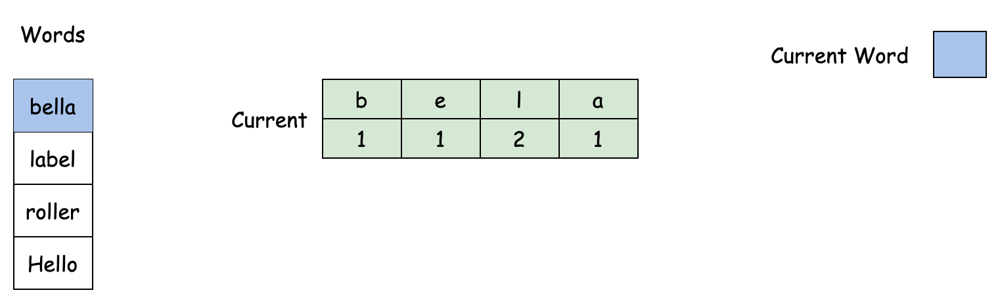
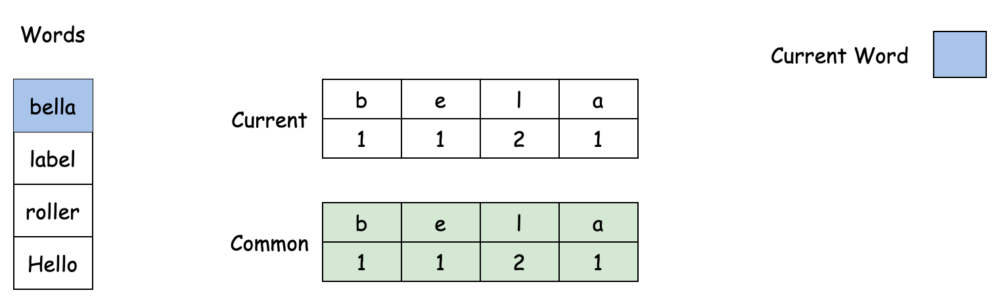
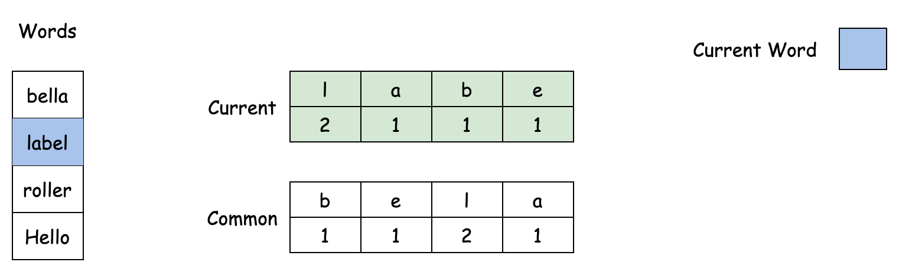
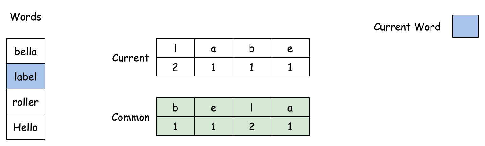
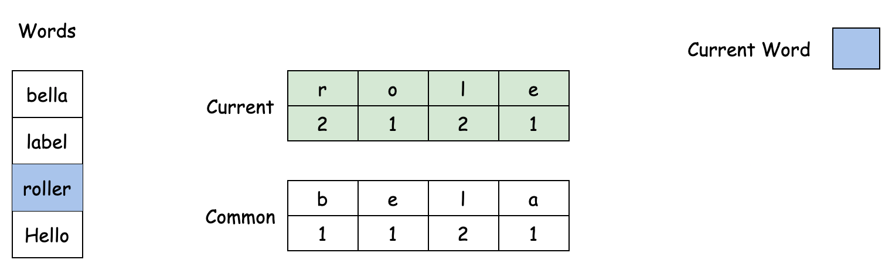
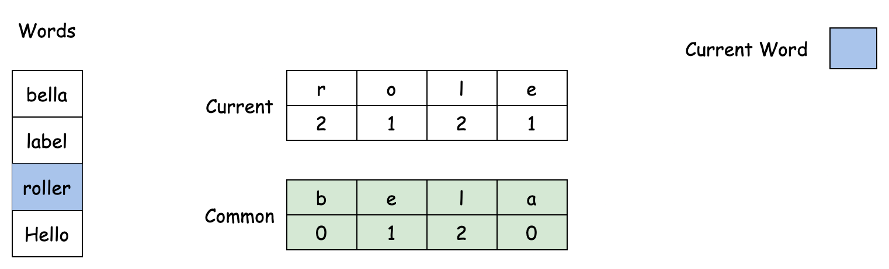
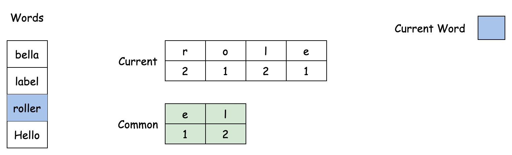
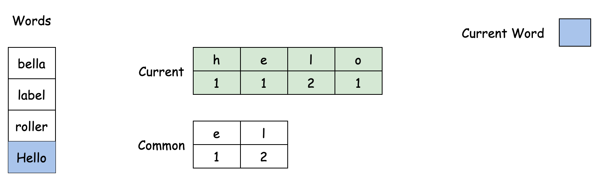
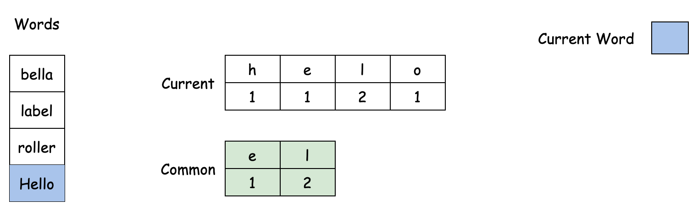

# 1002. Find Common Characters

Given a string array `words`, return _an array of all characters that show up in all strings within the_ `words` _(including duplicates)_. You may return the answer in **any order**.

**Example 1:**

> **Input:** words = \["bella","label","roller"\]
>
> **Output:** \["e","l","l"\]

**Example 2:**

> **Input:** words = \["cool","lock","cook"\]
>
> **Output:** \["c","o"\]

## Constraints

* `1 <= words.length <= 100`
* `1 <= words[i].length <= 100`
* `words[i]` consists of lowercase English letters.

## Topics

* `Array`
* `Hash Table`
* `String`

## Solution

### Overview

We need to keep track of the frequencies of the letters in each string, and the frequencies of letters that the different strings have in common.

Any time we have an array of strings and want to track how often each character appears, we should think about a way to efficiently store and update the frequency of the characters as we iterate over the array/string.

Here are some other problems that use this idea:

* [49\. Group Anagrams](https://leetcode.com/problems/group-anagrams/description/)
* [242\. Valid Anagram](https://leetcode.com/problems/valid-anagram/description/)
* [350\. Intersection of Two Arrays II](https://leetcode.com/problems/intersection-of-two-arrays-ii/description/)

A common mistake when solving this type of problem is to overlook whether or not we need to track duplicate characters. Example 1 in this problem highlights the need to return the letters that the strings have in common the same number of times they appear in all of the strings. This small detail is easy to miss and can potentially steer you away from the right solution.

* * *

### Approach: Array + Frequency Intersection

#### Intuition

To find common characters in `words`, we traverse the array and incrementally accumulate character frequencies of each string as we go. We need to make sure we store both the list of common characters and their counts.

Let's say we have the list and count of the common characters for the previous strings in `words` up to a certain point. To find the common characters for the next string immediately following this point, we compare this list with the character counts of that next string. We update the list to keep the smaller count for each character, setting the count to zero if the character is absent in the next string.

We keep the smaller count because it ensures the character is present in all the strings processed so far.












One option would be to use a hash set to store the frequencies of the characters for a string, iterating the characters one by one and incrementing their entry in the hash set. Can you think of a more efficient data structure, knowing that all characters of our strings are lowercase English letters? We can solve this problem more efficiently with an array with a fixed size of 26 for each letter of the alphabet.

> Note: This is a very common optimization technique, if you are asked a question in an interview that involves counting the occurrences of characters in a string, clarify the constraints of the characters with the interviewer and adjust your data structure according to that constraint.

#### Algorithm

1. Initialization:
    * Create a list `commonCharacterCounts` of size `26`, initialized to `0`.
    * Create a list `currentCharacterCounts` of size `26`, initialized to `0`.
    * Create an empty list `result`.
2. Iterate through `words` from left to right:
    * For the first string in `words`:
        * For each character in the first string, increment the corresponding position in `commonCharacterCounts`.
    * For each subsequent word in `words`:
        * Reset `currentCharacterCounts` to `0`.
        * For each character in the current word, increment the corresponding position in `currentCharacterCounts`.
        * For each letter from 'a' to 'z':
            * Update `commonCharacterCounts` at that letter to be the minimum of its current value and the value in `currentCharacterCounts`.
3. Collect common characters:
    * For each letter from 'a' to 'z':
        * For the number of times indicated by `commonCharacterCounts` at that letter, append the character corresponding to the letter to `result`.
4. Return the `result` list.

#### Implementation

```python
class Solution:

    def commonChars(self, words: List[str]) -> List[str]:
        words_size = len(words)
        result = []

        # Initialize common_character_counts with the characters from the first word
        common_character_counts = collections.Counter(words[0])

        for i in range(1, words_size):
            # Count characters in the current word
            current_character_counts = collections.Counter(words[i])

            # Update the common character counts to keep the minimum counts
            for letter in common_character_counts.keys():
                common_character_counts[letter] = min(
                    common_character_counts[letter],
                    current_character_counts[letter],
                )

        # Collect the common characters based on the final counts
        for letter, count in common_character_counts.items():
            for _ in range(count):
                result.append(letter)

        return result
```

#### Complexity Analysis

Let n be the number of strings in `words`, and k be the average length of the strings in `words`.

* Time Complexity: $O(n \cdot k)$

    Initializing the `commonCharacterCounts` array with the characters from the first word takes $O(k)$ time.

    For each of the remaining $n−1$ words, we count the characters in the current word and update the `commonCharacterCounts` array.

    Counting characters in each word and updating the `commonCharacterCounts` array both take $O(k)$ time.

    Summing these times across all the strings in `words` gives $O(k+(n−1) \cdot k)=O(n \cdot k)$.

* Space Complexity: $O(1)$

    The space used by the `commonCharacterCounts` and `currentCharacterCounts` arrays are constant, as they always have a size of `26` (the number of lowercase English letters).

    Beyond these arrays, the algorithm uses a constant amount of additional space for variables `words_size`, `i`, and `letter`.

    Therefore, the space complexity is $O(1)$.
