# 1051. Height Checker

A school is trying to take an annual photo of all the students. The students are asked to stand in a single file line in **non-decreasing order** by height. Let this ordering be represented by the integer array `expected` where `expected[i]` is the expected height of the `ith` student in line.

You are given an integer array `heights` representing the **current order** that the students are standing in. Each `heights[i]` is the height of the `ith` student in line (**0-indexed**).

Return _the **number of indices** where_ `heights[i] != expected[i]`.

**Example 1:**

> **Input:** heights = \[1,1,4,2,1,3\]
>
> **Output:** 3
>
> **Explanation:**
>
> heights:  \[1,1,4,2,1,3\]
>
> expected: \[1,1,1,2,3,4\]
>
> Indices 2, 4, and 5 do not match.

**Example 2:**

> **Input:** heights = \[5,1,2,3,4\]
>
> **Output:** 5
>
> **Explanation:**
>
> heights:  \[5,1,2,3,4\]
>
> expected: \[1,2,3,4,5\]
>
> All indices do not match.

**Example 3:**

> **Input:** heights = \[1,2,3,4,5\]
>
> **Output:** 0
> **Explanation:**
>
> heights:  \[1,2,3,4,5\]
>
> expected: \[1,2,3,4,5\]
>
> All indices match.

## Constraints

* `1 <= heights.length <= 100`
* `1 <= heights[i] <= 100`

## Topics

* Array
* Sorting
* Counting Sort

## Hints

1. Build the correct order of heights by sorting another array, then compare the two arrays.

## Solution

### Overview

In this problem, we are required to find the number of elements that are different than the respective index if the array is sorted. We must sort the given array and compare the sorted and unsorted arrays.

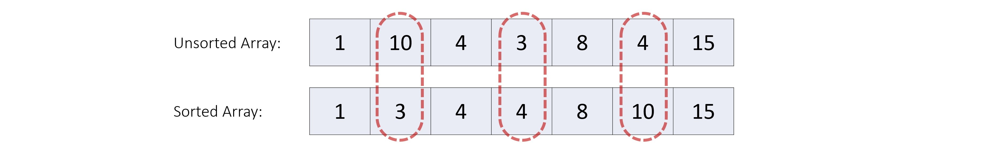

**Key Observation:** The purpose of this problem is to evaluate the interviewee's understanding of sorting algorithms and their ability to implement these algorithms without relying on built-in sort methods.

There are a variety of sorting algorithms such as Bubble Sort, Insertion Sort, Selection Sort, Merge Sort, Heap Sort, Quick Sort, Counting Sort, Radix Sort, and others.

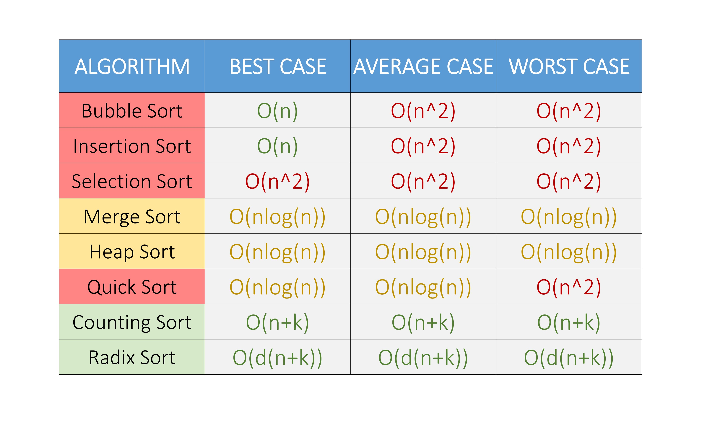

We attached a list of time complexities of some popular sorting algorithms. Here, `n` is the number of elements in the array, `k` is the size of buckets used, and `d` is the number of digits in the maximum element in the array.

In this article, we will concentrate on five algorithms that are deemed efficient and reasonable to implement during a real interview setting for this particular problem - **Bubble Sort, Merge Sort, Heap Sort, Counting Sort, and Radix Sort**. We will give brief descriptions of these algorithms but won't cover them in great detail.

**Note:** We highly recommend implementing the other sorting algorithms on your own, too, for more practice.

* * *

### Approach 1: Bubble Sort

#### Intuition

Bubble Sort is a classic sorting algorithm known for its simplicity. Bubble Sort operates by repeatedly stepping through the list, comparing adjacent elements, and swapping them if they are in the wrong order. The pass through the list is repeated until the list is sorted.

Here's a breakdown of how Bubble Sort works:

* **Iterate through the list:** Bubble Sort starts at the beginning of the list and compares adjacent pairs of elements.

* **Compare adjacent elements:** For each pair of adjacent elements, Bubble Sort compares them and swaps them if they are in the wrong order.

* **Repeat until sorted:** Bubble Sort continues making passes through the list, comparing and swapping adjacent elements until the entire list is sorted.

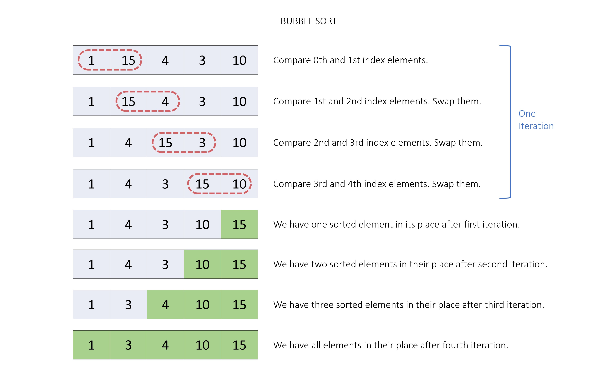

#### Algorithm

1. Create a function called `bubbleSort` which takes in the original array `arr` as a parameter.

    * Initialize the variable `n` with the length of the array `arr`.
    * Iterate through the array `arr` from index `i = 0` to `n - 1`.
        * Initialize a nested loop from index `j = 0` to `n - i - 1`.
            * In each iteration, compare the current element `arr[j]` with the next element `arr[j + 1]`.
            * If `arr[j]` is greater than `arr[j + 1]`, swap the elements to place the smaller element before the larger one.
2. Create a new array, `sortedHeights`, with the same elements as the `heights` array.

3. Sort the `sortedHeights` array using the `bubbleSort` function.

4. Iterate through all indices of the `heights` array, comparing each element with the corresponding element in the `sortedHeights` array. Count the number of indices where the elements differ.

5. Return the total count of indices with differing elements.

#### Implementation

```python
class Solution:
    def heightChecker(self, heights: List[int]) -> int:
        # Function to perform bubble sort on the input array.
        def bubble_sort():
            n = len(sorted_heights)
            # Loop through the array for bubble sort passes.
            for i in range(n - 1):
                # Inner loop to compare and swap elements.
                for j in range(n - i - 1):
                    # Compare and swap if elements are in the wrong order.
                    if sorted_heights[j] > sorted_heights[j + 1]:
                        sorted_heights[j], sorted_heights[j + 1] = (
                            sorted_heights[j + 1],
                            sorted_heights[j],
                        )

        # Sort the array using bubble sort.
        sorted_heights = heights[:]
        bubble_sort()

        count = 0
        # Loop through the original and sorted arrays.
        for i in range(len(sorted_heights)):
            # Increment count if elements at the same index differ.
            if heights[i] != sorted_heights[i]:
                count += 1
        # Return the total count of differing elements.
        return count
```

#### Complexity Analysis

Here, n is the number of elements in the `heights` array.

* Time complexity: O(n2)

  * To sort the array we iterate on the array n−1 times, each iteration will take O(n) time. Thus, sorting will take O(n2) time.
  * While comparing sorted and unsorted arrays, we again iterate on n elements, which will take O(n) time.
  * Thus, overall it takes O(n+n2)\=O(n2) time.
* Space complexity: O(n)

  * The sorting happens in place, but we created an additional array `sortedHeights` of size n.
  * Thus, overall we use O(n) space.

* * *

### Approach 2: Merge Sort

#### Intuition

Merge Sort is a divide-and-conquer sorting algorithm. The intuition behind it is to divide the data set into smaller and smaller sub-arrays until it is easy to sort, and then merge the sorted sub-arrays back into a larger sorted array.

The steps for implementing Merge Sort are as follows:

* **Divide the data set into two equal parts:** The first step in the Merge Sort algorithm is to divide the data set into two equal halves. This is done by finding the middle point of the data set and splitting the data into two parts.

* **Recursively sort each half:** Once the data set is divided into two halves, the Merge Sort function is called recursively on each half. The recursive calls continue until each half of the data is sorted into single-element arrays.

* **Merge the sorted halves:** Once each half of the data is sorted, the two halves are merged back into one final sorted array. The merging process involves comparing the first elements of each half and inserting the smaller element into the final array. This process continues until one of the halves is empty. The remaining elements of the other half are then inserted into the final array.

* **Repeat the process until the entire data is sorted:** The Merge Sort function is called recursively until the entire data set is sorted.

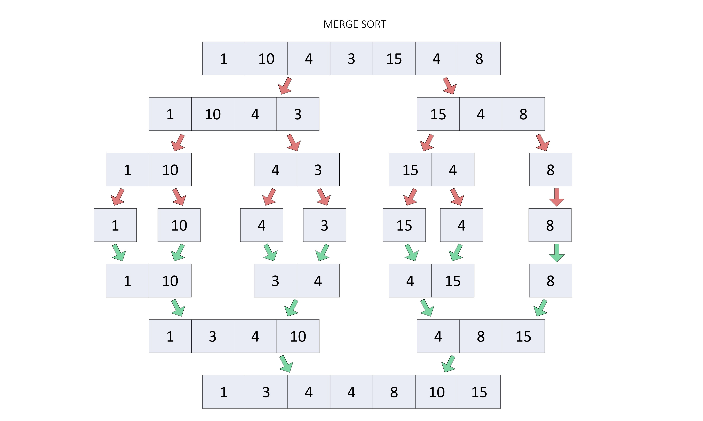

#### Algorithm

1. Create a helper function called `merge` which takes in the original array `arr`, indices `left`, `mid`, `right`, and a temporary array `tempArr` as parameters.

    * Calculate the start indices and sizes of the two halves of the array. The first half starts from the `left` index and the second half starts from `mid + 1`.
    * Copy elements of both halves into the temporary array.
    * Merge the sub-arrays from the temporary array `tempArr` back into the array `arr` in a sorted order using a while loop. The loop runs until either the first half or second half is completely merged. In each iteration, the smaller of the two elements from the first and second half is copied into the array `arr`.
    * Copy any remaining elements from the first half or second half into the array `arr`.
2. Create a recursive function called `mergeSort`, which takes in the original array `arr`, indices `left` and `right`, and a temporary array `tempArr` as parameters.

    * Check if the `left` index is greater than or equal to the `right` index. If it is, we return from the function.
    * Calculate the `mid` index.
    * Sort the first and second halves of the array recursively by calling the `mergeSort` function.
    * Merge the sorted halves by calling the `merge` function.
3. Create a temporary array `temporaryArray` with the same size as the `heights` array.

4. Create a new array, `sortedHeights`, with the same elements as the `heights` array.

5. Sort the `sortedHeights` array using the `mergeSort` function.

6. Iterate through all indices of the `heights` array, comparing each element with the corresponding element in the `sortedHeights` array. Count the number of indices where the elements differ.

7. Return the total count of indices with differing elements.

#### Implementation

```python
class Solution:
    # Function to merge two sub-arrays in sorted order.
    def merge(self, arr, left, mid, right, temp_arr):
        # Calculate the start and sizes of two halves.
        start1 = left
        start2 = mid + 1
        n1 = mid - left + 1
        n2 = right - mid

        # Copy elements of both halves into a temporary array.
        for i in range(n1):
            temp_arr[start1 + i] = arr[start1 + i]
        for i in range(n2):
            temp_arr[start2 + i] = arr[start2 + i]

        # Merge the sub-arrays in 'temp_arr' back into the original array 'arr' in sorted order.
        i, j, k = 0, 0, left
        while i < n1 and j < n2:
            if temp_arr[start1 + i] <= temp_arr[start2 + j]:
                arr[k] = temp_arr[start1 + i]
                i += 1
            else:
                arr[k] = temp_arr[start2 + j]
                j += 1
            k += 1

        # Copy remaining elements
        while i < n1:
            arr[k] = temp_arr[start1 + i]
            i += 1
            k += 1
        while j < n2:
            arr[k] = temp_arr[start2 + j]
            j += 1
            k += 1

    # Recursive function to sort an array using merge sort.
    def merge_sort(self, arr, left, right, temp_arr):
        if left >= right:
            return
        mid = (left + right) // 2
        # Sort first and second halves recursively.
        self.merge_sort(arr, left, mid, temp_arr)
        self.merge_sort(arr, mid + 1, right, temp_arr)
        # Merge the sorted halves.
        self.merge(arr, left, mid, right, temp_arr)

    def heightChecker(self, heights: List[int]) -> int:
        # Sort the array using merge sort.
        sorted_heights = heights[:]
        temp_arr = [0] * len(heights)
        self.merge_sort(sorted_heights, 0, len(sorted_heights) - 1, temp_arr)

        count = 0
        # Loop through the original and sorted arrays.
        for i in range(len(sorted_heights)):
            # Increment count if elements at the same index differ.
            if heights[i] != sorted_heights[i]:
                count += 1
        # Return the total count of differing elements.
        return count
```

#### Complexity Analysis

Here, n is the number of elements in the `heights` array.

* Time complexity: O(nlogn)

  * While sorting, we divide the `arr` array into two halves till there is only one element in the array, which will lead to O(logn) steps.
        n→n/2→n/4→...→1 (k steps)
        n/2(k−1)\=1⟹ k≈logn
  * After each division, we merge those respective halves which will take O(n) time each. Thus, sorting will take O(nlogn) time.
  * While comparing sorted and unsorted arrays, we again iterate on n elements, which will take O(n) time.
  * Thus, overall it takes O(n+nlogn)\=O(nlogn) time.
* Space complexity: O(n)

  * The recursive stack will take O(logn) space, and we used additional arrays, `temporaryArray` and `sortedHeights` of size n each.
  * Thus, overall we use O(logn+2n)\=O(n) space.

* * *

### Approach 3: Heap Sort

#### Intuition

The intuition behind Heap Sort is to organize the elements of the data set into a binary heap (a max binary heap, or a min binary heap), which provides a fast way to access the largest (or smallest) element. We will implement Heap Sort using a max binary heap. A max binary heap is a complete binary tree-based data structure where a parent node must be greater than or equal to its children nodes. This property ensures that the largest element is always at the root node of the max binary heap.

The steps for implementing Heap Sort are as follows:

* **Build the binary heap:** Organize the elements of the array into a max binary heap such that the parent node is either greater than or equal to its children nodes. In the resulting max binary heap we will have the largest element at the root node.

* **Swap the root node and the last element:** Swap the root node (which is the largest element) with the last element in the heap. This places the largest element at the end of the array.

* **Rebuild the heap:** Rebuild the heap with the new root node to satisfy the heap property without considering the already swapped elements from the array.

* **Repeat steps 2 and 3:** Repeat steps 2 and 3 until the binary heap is empty and the array is sorted in ascending order.

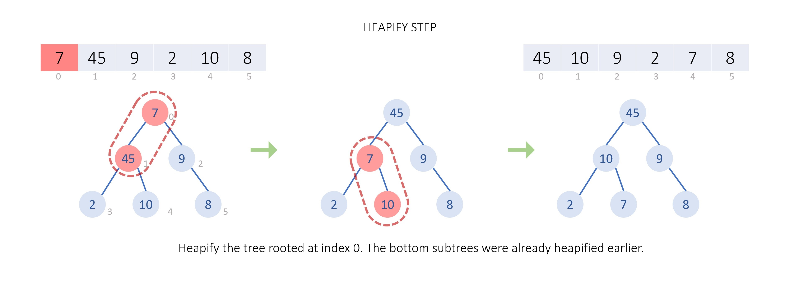

Test
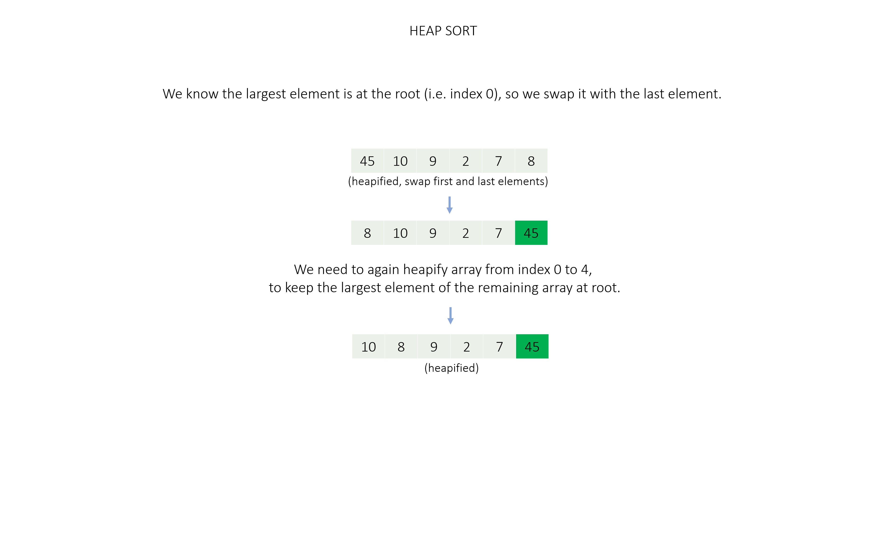
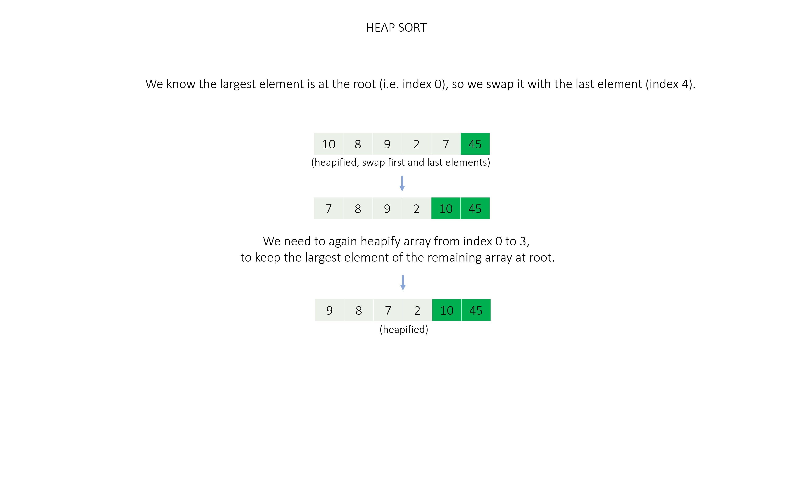
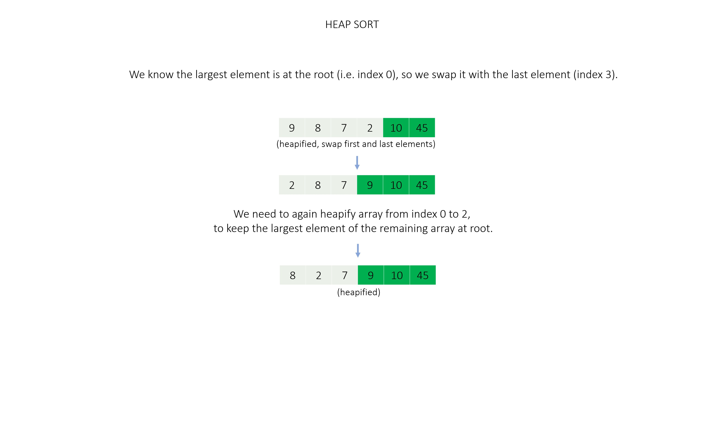
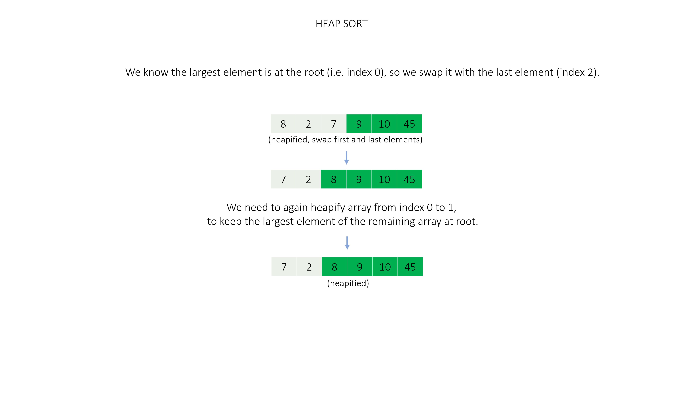
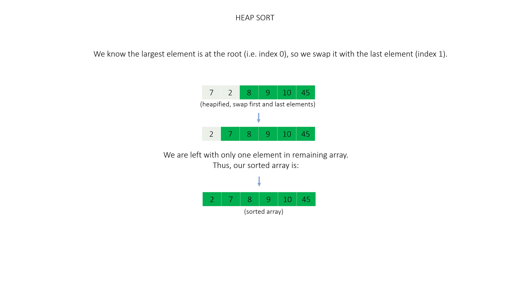

#### Algorithm

1. Create a function `heapify` that takes the original array `arr`, size `n`, and index `i` as input.

    * Initialize `largest` as `i`.
    * Calculate the left child of node `i` as `2 * i + 1` and the right child as `2 * i + 2`.
    * If the left child of node `i` is less than `n` and the value of the left child is greater than the value at `largest`, then set `largest` to `left`.
    * If the right child of node `i` is less than `n` and the value of the right child is greater than the value at `largest`, then set `largest` to `right`.
    * If `largest` is not equal to `i`, then swap the values at `i` and `largest`, and call `heapify` on the affected sub-tree rooted at `largest`.
2. Create a function `heapSort` that takes an array `arr` as input.

    * Initialize `n` as the size of the array.
    * Build the max heap by calling `heapify` function on each node (except leaf nodes).
    * Then, traverse the elements of the array `arr` from end to beginning, and for each element swap the root with the last element and call `heapify` on the reduced array to make sure it remains a max heap.
3. Create a new array, `sortedHeights`, with the same elements as the `heights` array.

4. Sort the `sortedHeights` array using the `heapSort` function.

5. Iterate through all indices of the `heights` array, comparing each element with the corresponding element in the `sortedHeights` array. Count the number of indices where the elements differ.

6. Return the total count of indices with differing elements.

#### Implementation

```python
class Solution:
    # Function to max heapify a subtree (in top-down order) rooted at index i.
    def heapify(self, arr, n, i):
        # Initialize largest as root 'i'.
        largest, left, right = i, 2 * i + 1, 2 * i + 2

        # If the left child is larger than the root.
        if left < n and arr[left] > arr[largest]:
            largest = left

        # If the right child is larger than the largest so far.
        if right < n and arr[right] > arr[largest]:
            largest = right

        # If largest is not root swap root with the largest element
        # Recursively heapify the affected sub-tree (i.e. move down).
        if largest != i:
            arr[i], arr[largest] = arr[largest], arr[i]
            self.heapify(arr, n, largest)

    def heap_sort(self, arr):
        n = len(arr)
        # Build heap; heapify all elements except leaf nodes, in bottom-up order.
        for i in range(n // 2 - 1, -1, -1):
            self.heapify(arr, n, i)

        # Traverse elements one by one, to move the current root to the end, and
        for i in range(n - 1, 0, -1):
            arr[0], arr[i] = arr[i], arr[0]
            # call max heapify on the reduced array.
            self.heapify(arr, i, 0)

    def heightChecker(self, heights: List[int]) -> int:
        # Sort the array using heap sort.
        sorted_heights = heights[:]
        self.heap_sort(sorted_heights)

        count = 0
        # Loop through the original and sorted arrays.
        for i in range(len(sorted_heights)):
            # Increment count if elements at the same index differ.
            if heights[i] != sorted_heights[i]:
                count += 1
        # Return the total count of differing elements.
        return count
```

#### Complexity Analysis

Here, n is the number of elements in the `heights` array.

* Time complexity: O(nlogn)

  * Initially, heapifying the whole `nums` array will take O(n) time.
  * While heapifying the `nums` array after swapping the first element with the last, we traverse the height of the complete binary tree made using n elements, which leads to O(logn) time operations, and this heapifying is done n times, once for each element. Thus, sorting will take O(n+nlogn)\=O(nlogn) time.
  * While comparing sorted and unsorted arrays, we again iterate on n elements, which will take O(n) time.
  * Thus, overall it takes O(n+nlogn)\=O(nlogn) time.
* Space complexity: O(n)

  * The recursive stack will take O(logn) space, the sorting happens in place.

  * We created an additional array `sortedHeights` of size n.

  * Thus, overall we use O(n) space.

* * *

### Approach 4: Counting Sort

#### Intuition

The intuition behind counting sort is to count the frequency of each element in the input array and then place the elements in their correct positions based on their values and frequencies. Counting sort is a non-comparative sorting algorithm and is useful in situations where the elements in the array have a limited range.

The steps for implementing Counting Sort are as follows:

* **Create a counting hash map:** Create a hash map that stores the frequency of each element.

* **Find the minimum and maximum values:** Iterate over the input array to find the minimum and maximum elements that will be used later on.

* **Count the frequency of each element:** Loop through the input array and increase the count of the corresponding element in the counting hash map.

* **Place elements in the original array:** Loop through the range of elements in the input array from the minimum value to the maximum value and place each element in its proper position in the original array based on the frequency in the hash map.

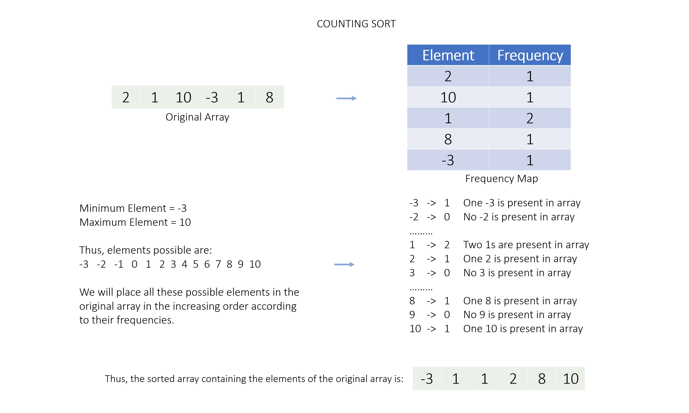

#### Algorithm

1. Create a function `countingSort` to sort the original array `arr`.

    * Create a counting hash map `counts` to store the count of each element of the array.
    * Find the minimum and maximum values `minVal` and `maxVal` in the array.
    * Iterate through the array `arr` and update the count of each element in the hash map.
    * Initialize a variable `index` to zero, which will be used to store the sorted elements in the array `arr`.
    * Start a loop that goes from the minimum value `minVal` to the maximum value `maxVal`.
        * For each value `val` in the loop, check if its count in the hash map `counts` is greater than zero. If it is, overwrite that value in the array `arr` starting at the `index` position. Update the `index` and decrease the count of the value in the hash map `counts` by `1`.
    * The input array `arr` should now be sorted.
2. Create a new array, `sortedHeights`, with the same elements as the `heights` array.

3. Sort the `sortedHeights` array using the `countingSort` function.

4. Iterate through all indices of the `heights` array, comparing each element with the corresponding element in the `sortedHeights` array. Count the number of indices where the elements differ.

5. Return the total count of indices with differing elements.

#### Implementation

```python
class Solution:
    def counting_sort(self, arr):
        # Create the counting hash map.
        counts = {}
        # Find the minimum and maximum values in the array.
        min_val, max_val = min(arr), max(arr)

        # Update element's count in the hash map.
        for val in arr:
            if val in counts:
                counts[val] += 1
            else:
                counts[val] = 1

        index = 0
        # Place each element in its correct position in the array.
        for val in range(min_val, max_val + 1):
            # Append all 'val's together if they exist.
            while counts.get(val, 0) > 0:
                arr[index] = val
                index += 1
                counts[val] -= 1

    def heightChecker(self, heights: List[int]) -> int:
        # Sort the array using counting sort.
        sorted_heights = heights[:]
        self.counting_sort(sorted_heights)

        count = 0
        # Loop through the original and sorted arrays.
        for i in range(len(sorted_heights)):
            # Increment count if elements at the same index differ.
            if heights[i] != sorted_heights[i]:
                count += 1
        # Return the total count of differing elements.
        return count
```

#### Complexity Analysis

Here, n is the number of elements in the `heights` array, and k is the range of value of its elements (minimum value to maximum value).

* Time complexity: O(n+k)

  * We iterate on the array elements while counting the frequency and finding minimum and maximum values, taking O(n) time.
  * Then we iterate on the input array's element's range, which will take O(k) time. Thus, sorting will take O(n+k) time.
  * While comparing sorted and unsorted arrays, we again iterate on n elements, which will take O(n) time.
  * Thus, overall it takes O(n+n+k)\=O(n+k) time.
* Space complexity: O(n)

  * We use a hash map `counts` which might store all O(n) elements of the input array in worst-case.
  * We created an additional array `sortedHeights` of size n.
  * Thus, overall we use O(n) space.

* * *

### Approach 5: Radix Sort

#### Intuition

The intuition behind radix sort is that it takes advantage of the fact that integers have a finite number of digits and each digit can have a limited number of values (0 to 9). Instead of comparing elements, it sorts elements by the individual digits of the integers.

> This approach is not expected by the interviewer and is a bit complex to code during an interview setting, but we are listing it here to show you how you can use a radix sort on integer arrays.

The steps for implementing Radix Sort are as follows:

* **Sort array using bucket sort:** For each place value (unit place to last place) sort the array using counting/bucket sort.

* **Bucket Sort:** We need 10 buckets for each digit (0 - 9), and we will push array elements into their respective bucket and fetch the elements from each bucket one by one in the order it was pushed in the bucket.

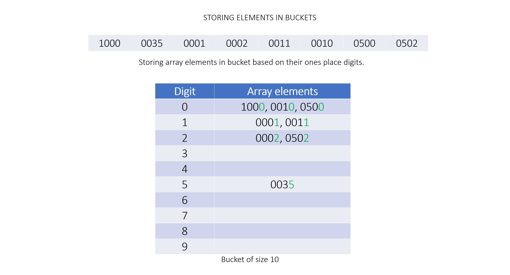

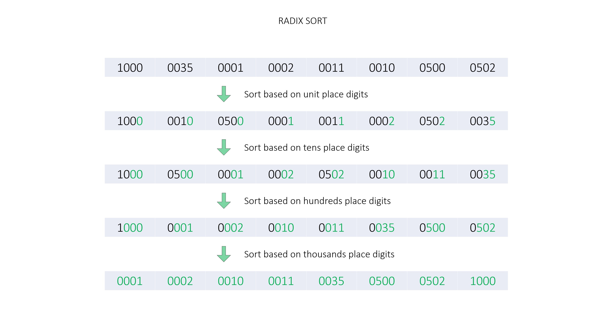

#### Algorithm

1. Create a function, `bucketSort`, which takes an array `arr` and an integer `placeValue` (indicating the place according to which the array will be sorted) as input.

    * Create 2D array `buckets` with `10` rows, to store respective bucket elements together.
    * Loop through each element in `arr`, find the digit of the number based on the current place value, and store it in the respective bucket.
    * Overwrite `arr` with the elements stored in each bucket in the correct order.
2. Create a function `radixSort` which takes an array `arr` as input.

    * Find the maximum absolute value `maxElement` in `arr` and find the number of digits `maxDigits` in the maximum element.
    * Loop through the digits, starting from the least significant digit place, and call `bucketSort` for each place value.
3. Create a new array, `sortedHeights`, with the same elements as the `heights` array.

4. Sort the `sortedHeights` array using the `radixSort` function.

5. Iterate through all indices of the `heights` array, comparing each element with the corresponding element in the `sortedHeights` array. Count the number of indices where the elements differ.

6. Return the total count of indices with differing elements.

#### Implementation

```python
class Solution:
    # Bucket sort function for each place value digit.
    def bucket_sort(self, arr, place_value):
        buckets = [[] for _ in range(10)]

        # Store the respective number based on its digit.
        for val in arr:
            digit = abs(val) // place_value
            digit = digit % 10
            buckets[digit].append(val)

        # Overwrite 'arr' in sorted order of current place digits.
        index = 0
        for digit in range(10):
            for val in buckets[digit]:
                arr[index] = val
                index += 1

    # Radix sort function.
    def radix_sort(self, arr):
        # Find the absolute maximum element to find max number of digits.
        max_element, max_digits = max(abs(val) for val in arr), 0
        while max_element > 0:
            max_digits += 1
            max_element //= 10

        # Radix sort, least significant digit place to most significant.
        place_value = 1
        for _ in range(max_digits):
            self.bucket_sort(arr, place_value)
            place_value *= 10

    def heightChecker(self, heights: List[int]) -> int:
        # Sort the array using radix sort.
        sorted_heights = heights[:]
        self.radix_sort(sorted_heights)

        count = 0
        # Loop through the original and sorted arrays.
        for i in range(len(sorted_heights)):
            # Increment count if elements at the same index differ.
            if heights[i] != sorted_heights[i]:
                count += 1
        # Return the total count of differing elements.
        return count
```

#### Complexity Analysis

Here, n is the number of elements in the `heights` array, d is the number of digits in the maximum element, and b\=10 is the size of the bucket used.

* Time complexity: O(d⋅(n+b))

  * We iterate on the array elements to find the maximum number and then find the count of its digits, taking O(n+d) time.
  * Then we sort the array for each integer place which will take O(n+b) time, thus for all d places it will take O(d⋅(n+b)) time. Thus, sorting will take O((n+d)+d⋅(n+b))\=O(d⋅(n+b)) time.
  * While comparing sorted and unsorted arrays, we again iterate on n elements, which will take O(n) time.
  * Therefore, overall it takes O(n+d⋅(n+b))\=O(d⋅(n+b)) time.
* Space complexity: O(n+b)

  * We create an additional array `sortedHeights` of size n and `buckets` which use O(n+b) space.
  * Thus, overall we use O(n+b) space.
