# 209. Minimum Size Subarray Sum

Given an array of positive integers `nums` and a positive integer `target`, return _the **minimal length** of a_ _subarray_ _whose sum is greater than or equal to_ `target`. If there is no such subarray, return `0` instead.

**Example 1:**

> **Input:** target = 7, nums = [2,3,1,2,4,3]
>
> **Output:** 2
>
> **Explanation:** The subarray [4,3] has the minimal length under the problem constraint.

**Example 2:**

> **Input:** target = 4, nums = [1,4,4]
>
> **Output:** 1

**Example 3:**

> **Input:** target = 11, nums = [1,1,1,1,1,1,1,1]
>
> **Output:** 0

## Constraints

* 1 <= `target` <= $10^9$
* 1 <= `nums.length` <= $10^5$
* 1 <= `nums[i]` <= $10^4$

## Follow up

If you have figured out the $O(n)$ solution, try coding another solution of which the time complexity is $O(n \log(n))$

## Topics

* `Array`
* `Binary Search`
* `Sliding Window`
* `Prefix Sum`

## Similar Questions

Hard

* [76. Minimum Window Substring]()

Medium

* [718. Maximum Length of Repeated Subarray]()
* [1658. Minimum Operations to Reduce X to Zero]()
* [2090. K Radius Subarray Averages]()
* [2233. Maximum Product After K Increments]()

Easy

* [3095. Shortest Subarray With OR at Least K I]()
* [3364. Minimum Positive Sum Subarray](3364_minimum_positive_sum_subarray.md)

## Solution

### Overview

Given an array of positive integers `nums` and a positive integer `target`, our task is to return the minimal length of a subarray whose sum is greater than or equal to `target`. If there is no such subarray, we have to return `0`.

### Approach: Sliding Window

#### Intuition

An intuitive technique is to go through all the subarrays one by one and check the sum of each one. If the total of the subarray under consideration is larger than or equal to `target`, we attempt to update our answer variable by using the minimum of the current answer and the length of this subarray. To get all the subarrays, we can run two loops: the outer loop selects a starting point and the inner loop selects an ending point. This solution, however, will take O(n2) time, resulting in a time limit exceeded (TLE).

Let's think whether we really need to iterate over all the subarrays.

Given that we only have positive integers, there is no purpose in adding further elements to a subarray if its sum exceeds or equals `target`. Adding more elements to such a subarray will result in the construction of longer subarrays, which is useless because we have already found a smaller subarray that meets our requirements.

Only if the sum of the current subarray under consideration is smaller than `target`, we should append elements to the subarray. When the sum of the subarrays exceeds or equals `target`, we will attempt to update our answer with the length of the current subarray.

We now try to remove the elements from the start and see if we can form a smaller subarray that meets our requirements. We remove the first element from the subarray and check if we still have the total higher than or equal to `target`. If the total exceeds or equals `target`, we have a smaller subarray that meets our requirement. As a result, we again try to update our answer with the length of the current subarray and repeat the process of eliminating the first element from the current subarray until the sum no longer exceeds or equals `target`.

Now after removing elements, if the sum of the subarray is less than `target`, we have to append more elements to it until the sum becomes larger than or equal to `target`. We append elements until the sum equals or exceeds `target`, then try to update our answer variable and repeat the process of eliminating the first element.

The above approach can be efficiently solved using the **sliding window approach**.

If you are not familiar with sliding window, please refer to our explore cards [Sliding Window Explore Card](https://leetcode.com/explore/featured/card/leetcodes-interview-crash-course-data-structures-and-algorithms/703/arraystrings/4502/).

A sliding window is achieved by using two pointers `left` and `right`, which point to the starting and ending indices of the subarray. We set them to a value of `0`.

To "add" elements to the window, we loop over the array by incrementing `right`. In this problem, if the sum of the window exceeds or equals `target`, we try to update our answer and then "remove" elements from the window by incrementing `left` until the sum is less than `target` again.

Here's a visual representation of how the approach works:

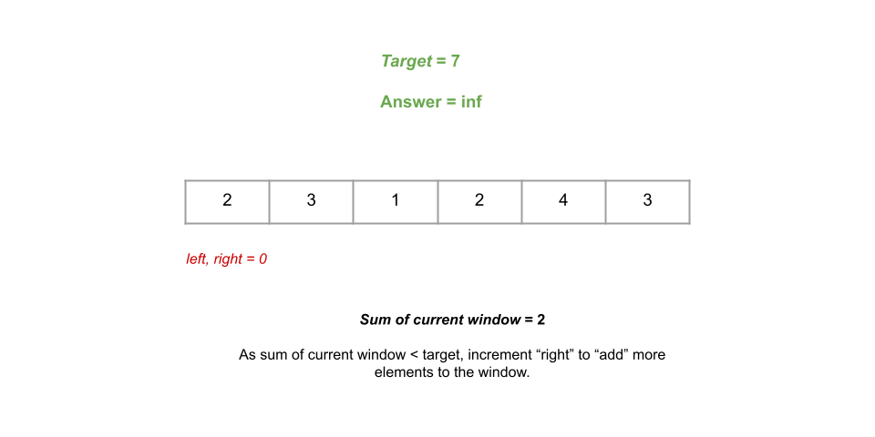
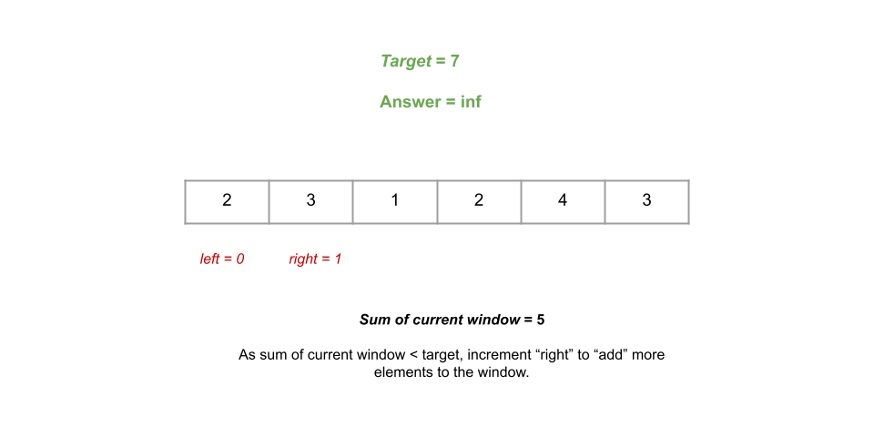
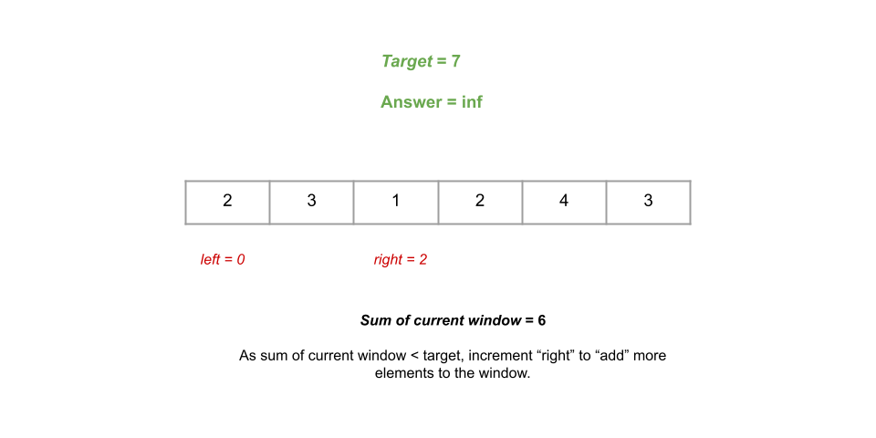
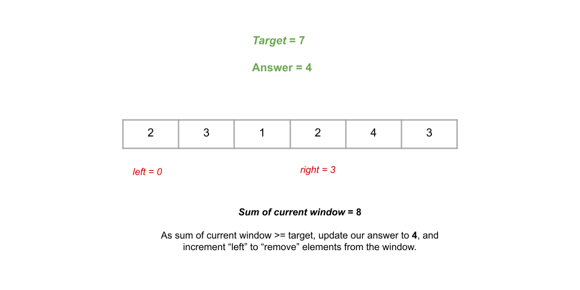
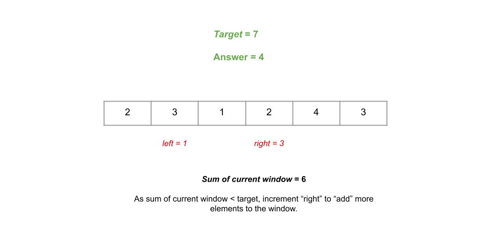
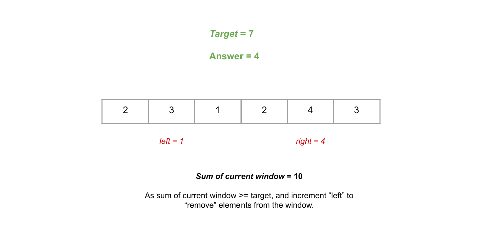
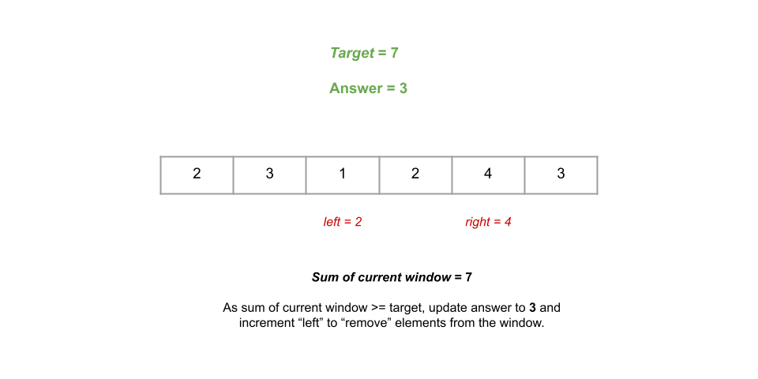
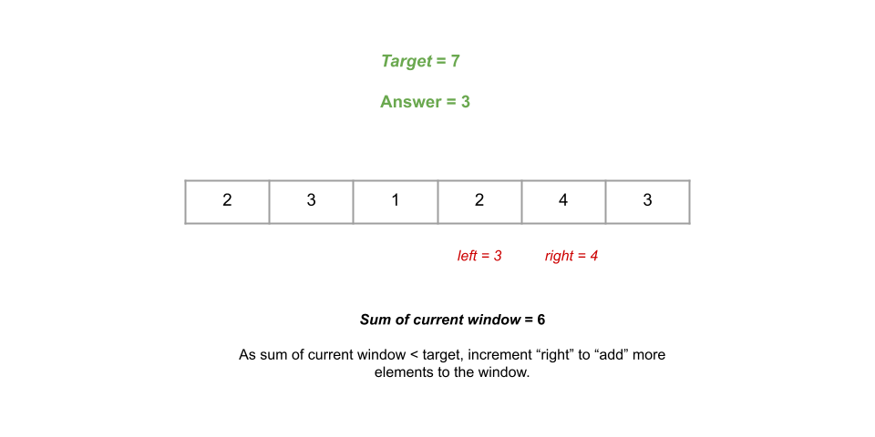
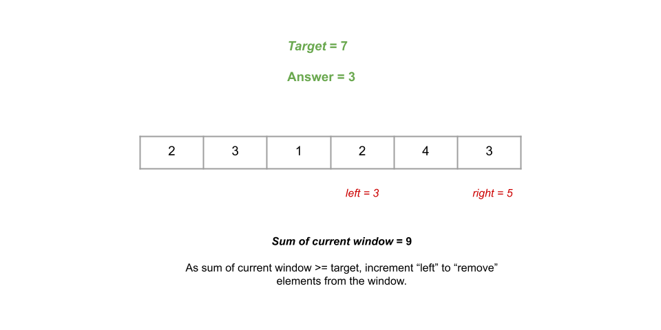
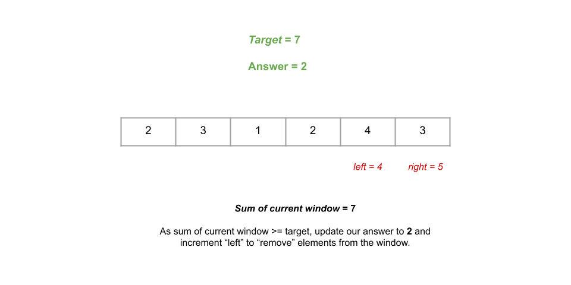
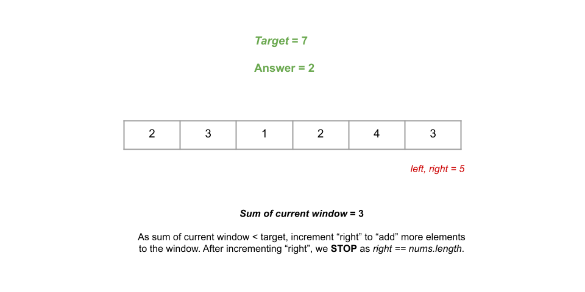

#### Algorithm

1. Create three integer variables `left`, `right` and `sumOfCurrentWindow`. The variables `left` and `right` form a subarray by pointing to the starting and ending indices of the current subarray (or window), and `sumOfCurrentWindow` stores the sum of this window. Initialize all of them with `0`.
2. Create another variable `res` to store the answer to the problem. We initialize it to a large integer value.
3. We iterate over `nums` using `right` starting from `right = 0` till `nums.length - 1` incrementing `right` by `1` after each iteration. We perform the following inside this iteration:
    * Add element at index `right` to the current window, incrementing `sumOfCurrentWindow` by `nums[right]`.
    * We check if `sumOfCurrentWindow >= target`. If so, we have a subarray that satisfies our condition. As a result, we attempt to update our answer variable with the length of this subarray. We perform `res = min(res, right - left + 1)`. We then remove the first element from this window by reducing `sumOfCurrentWindow` by `nums[left]` and incrementing `left` by `1`. This step is repeated in an inner loop as long as `sumOfCurrentWindow >= target`.
    * The current window's sum is now smaller than `target`. We need to add more elements to it. As a result, `right` is incremented by `1`.
4. Return `res`.

#### Implementation

```python
class Solution:
    def minSubArrayLen(self, target: int, nums: List[int]) -> int:
        left = 0
        right = 0
        sumOfCurrentWindow = 0
        res = float('inf')

        for right in range(0, len(nums)):
            sumOfCurrentWindow += nums[right]

            while sumOfCurrentWindow >= target:
                res = min(res, right - left + 1)
                sumOfCurrentWindow -= nums[left]
                left += 1

        return res if res != float('inf') else 0
```

#### Complexity Analysis

Here n is the length of `nums`.

* Time complexity: $O(n)$.

  * You may be thinking: there is an inner while loop inside another for loop, isn't the time complexity O(n2)? The reason it is still $O(n)$ is because the right pointer `right` can move n times and the left pointer `left` can move also n times in total. The inner loop is not running n times for each iteration of the outer loop. A sliding window guarantees a maximum of 2n window iterations. This is what is referred to as [amortized analysis](https://en.wikipedia.org/wiki/Amortized_analysis) - even though the worst case for an iteration inside the for loop is $O(n)$, it averages out to $O(1)$ when you consider the entire runtime of the algorithm.
* Space complexity: $O(1)$.

  * We are not using any extra space other than a few integer variables:`left`, `right`, `sumOfCurrentWindow`, and `res`, which takes up constant space each.
