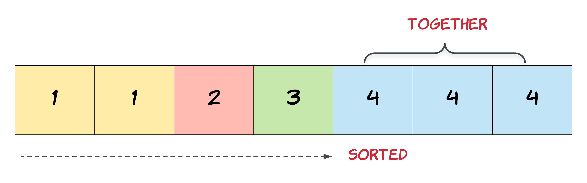

# 26. Remove Duplicates from Sorted Array

Given an integer array `nums` sorted in **non-decreasing order**, remove the duplicates [**in-place**](https://en.wikipedia.org/wiki/In-place_algorithm) such that each unique element appears only **once**. The **relative order** of the elements should be kept the **same**. Then return _the number of unique elements in_ `nums`.

Consider the number of unique elements of `nums` to be `k`, to get accepted, you need to do the following things:

* Change the array `nums` such that the first `k` elements of `nums` contain the unique elements in the order they were present in `nums` initially. The remaining elements of `nums` are not important as well as the size of `nums`.
* Return `k`.

**Custom Judge:**

The judge will test your solution with the following code:

```C
int\[\] nums = \[...\]; // Input array
int\[\] expectedNums = \[...\]; // The expected answer with correct length

int k = removeDuplicates(nums); // Calls your implementation

assert k == expectedNums.length;
for (int i = 0; i < k; i++) {
    assert nums\[i\] == expectedNums\[i\];
}
```

If all assertions pass, then your solution will be **accepted**.

**Example 1:**

> **Input:** nums = \[1,1,2\]
>
> **Output:** 2, nums = \[1,2,\_\]
>
> **Explanation:** Your function should return k = 2, with the first two elements of nums being 1 and 2 respectively.
>
> It does not matter what you leave beyond the returned k (hence they are underscores).

**Example 2:**

> **Input:** nums = \[0,0,1,1,1,2,2,3,3,4\]
>
> **Output:** 5, nums = \[0,1,2,3,4,\_,\_,\_,\_,\_\]
>
> **Explanation:** Your function should return k = 5, with the first five elements of nums being 0, 1, 2, 3, and 4 respectively.
>
> It does not matter what you leave beyond the returned k (hence they are underscores).

## Constraints

* `1 <= nums.length <= 3 * 104`
* `-100 <= nums[i] <= 100`
* `nums` is sorted in **non-decreasing** order.

## Topics

* `Array`
* `Two Pointers`

## Hints

1. In this problem, the key point to focus on is the input array being sorted. As far as duplicate elements are concerned, what is their positioning in the array when the given array is sorted? Look at the image below for the answer. If we know the position of one of the elements, do we also know the positioning of all the duplicate elements?

2. We need to modify the array in-place and the size of the final array would potentially be smaller than the size of the input array. So, we ought to use a two-pointer approach here. One, that would keep track of the current element in the original array and another one for just the unique elements.
3. Essentially, once an element is encountered, you simply need to **bypass** its duplicates and move on to the next unique element.

## Similar Questions

Easy

* [27. Remove Element](27_remove_element.md)
* [2460. Apply Operations to an Array](2460_apply_operations_to_an_array.md)

Medium

* [80. Remove Duplicates from Sorted Array II](80_remove_duplicates_from_sorted_array_2.md)
* [2615. Sum of Distances]()
