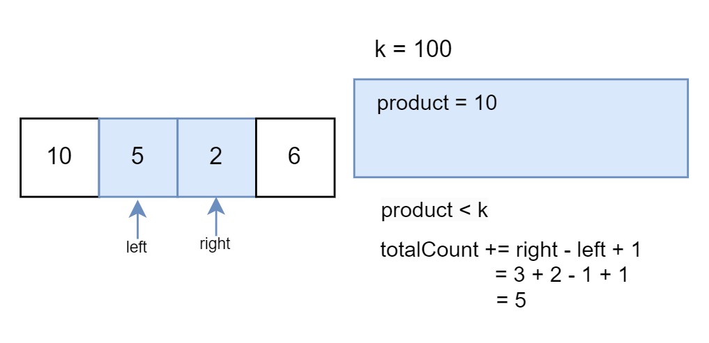

# 713. Subarray Product Less Than K

Given an array of integers `nums` and an integer `k`, return _the number of contiguous subarrays where the product of all the elements in the subarray is strictly less than_ `k`.

**Example 1:**

> **Input:** nums = \[10,5,2,6\], k = 100
>
> **Output:** 8
>
> **Explanation:** The 8 subarrays that have product less than 100 are:
>
> \[10\], \[5\], \[2\], \[6\], \[10, 5\], \[5, 2\], \[2, 6\], \[5, 2, 6\]
>
> Note that \[10, 5, 2\] is not included as the product of 100 is not strictly less than k.

**Example 2:**

> **Input:** nums = \[1,2,3\], k = 0
>
> **Output:** 0

## Constraints

* `1 <= nums.length <= 3 * 104`
* `1 <= nums[i] <= 1000`
* `0 <= k <= 106`

## Topics

* `Array`
* `Binary Search`
* `Sliding Window`
* `Prefix Sum`
* `Prefix Sum`
* `Two Pointers`

## Hints

1. For each j, let opt(j) be the smallest i so that nums\[i\] \* nums\[i+1\] \* ... \* nums\[j\] is less than k. opt is an increasing function.

* * *

## Similar Questions

Easy

* [Two Sum Less Than K]()

Medium

* [Maximum Product Subarray]()
* [Maximum Size Subarray Sum Equals k]()
* [Subarray Sum Equals K]()
* [Number of Smooth Descent Periods of a Stock]()

Hard

* [Count Subarrays With Score Less Than K]()

## Solution

### Overview

We are given an array of integers `nums` and an integer `k`; the task is to count the number of contiguous subarrays where the product of all the elements in the subarray is strictly less than `k`.

**Key Observations:**

1. The problem requires counting valid subarrays, not returning the actual subarrays.
2. The values in the `nums` array are positive.

### Approach 1: Using Sliding Window

#### Intuition

The brute force method involves finding all the subarrays and then selecting those whose products are less than `k`. However, this approach becomes costly in terms of time complexity, reaching $O(n^2)$.

For a more efficient approach, let's use the sliding window pattern. This pattern is applicable when the problem entails achieving a goal using subarrays, and individual elements cannot be independently selected.

The concept behind the sliding window pattern is to maintain a window that continuously expands from the right by adding elements and computing their product until the condition is met. Once the condition is satisfied, we adjust the window by shrinking it from the left until the condition is met again.

As we slide the window across the array, our objective is to identify all subarrays in the `nums` array where the product of its elements remains less than `k`. For each right position, if the product of the window's elements from left to right is less than `k`, adding the element at the right generates new subarrays with products less than `k`.

The count of such subarrays is determined by the difference `right - left + 1`, which represents the number of subarrays that end at `right` and start at any element between `right` and `left`, inclusive. In essence, this count encompasses the subarray consisting solely of the current element itself, as well as all possible subarrays extending back to the left boundary of the window (`left`).

Consider an example window containing elements 3, 4, and 5. If we include 6 in the window, we need to count all possible subarrays that end with 6. These subarrays can be formed by starting at any element within the current window and extending to 6. Therefore, the subarrays would be:

* `[6]` (subarray consisting only of 6)
* `[5, 6]` (subarray starting from 5 and ending at 6)
* `[4, 5, 6]` (subarray starting from 4 and ending at 6)
* `[3, 4, 5, 6]` (subarray starting from 3 and ending at 6)

By calculating `right - left + 1`, we enumerate all subarrays that end with the current element of the window (`nums[right]`). This ensures that we count all possible subarrays as we slide the window across the array. As we can observe, adding element 6 to the window created 4 new subarrays.

The crucial insight is that once the product becomes less than `k`, all possible subarrays formed by selecting subsets of elements within the current window (from left to right) will also have a product strictly less than `k`.

Hence, whenever the product is valid, we add the current window size (`right - left + 1`) to the total count of subarrays.

The following slideshow provides a clearer insight into the underlying approach:





#### Algorithm

* Check if `k` is less than or equal to 1. In this case, no subarrays can have a product less than `k`, so return 0.
* Initialize the variables `totalCount` to 0, to store the final count of subarrays with a product less than `k`, and `product` to 1, representing the product of elements within the window (initially empty).
* Use two pointers, `left` and `right`, to define the sliding window. Iterate through the `nums` array using a for loop until `right` reaches the end.
  * Inside the loop, multiply the current `product` by the element at the right pointer (`nums[right]`). This effectively includes the new element in the window.
  * While the current `product` is greater than or equal to `k`, the window needs to shrink to exclude elements that make the product exceed or equal to `k`.
    * Divide the `product` by the element at the left pointer (`nums[left]`).
    * Increment `left` by 1 to move the window one position to the right, effectively excluding the leftmost element.
  * Update the `totalCount` by adding the number of valid subarrays with the current window size, which is `right - left + 1`.
* Return the `totalCount`.

#### Implementation

```python
class Solution:
    def numSubarrayProductLessThanK(self, nums: List[int], k: int) -> int:
        # Handle edge cases where k is 0 or 1 (no subarrays possible)
        if k <= 1:
            return 0

        total_count = 0
        product = 1

        # Use two pointers to maintain a sliding window
        left = 0
        for right, num in enumerate(nums):
            product *= num  # Expand the window by including the element at the right pointer

            # Shrink the window from the left while the product is greater than or equal to k
            while product >= k:
                product //= nums[left]  # Remove the element at the left pointer from the product
                left += 1

            # Update the total count by adding the number of valid subarrays with the current window size
            total_count += right - left + 1  # right - left + 1 represents the current window size

        return total_count
```

#### Complexity Analysis

Let n be the length of `nums`.

* Time complexity: $O(n)$

    The algorithm iterates through the input array `nums` using a single for loop. Inside the loop, there are nested operations for shrinking the window, but since `left` is incremented a total number of `n` times during the whole array traversal, each element in the array is visited at most twice.

    The nested loop terminates when the product becomes less than `k`, and this can only happen at most `n` times total (once for each element). Therefore, the overall time complexity is $2n$, which we describe as $O(n)$.

* Space complexity: $O(1)$

    The algorithm uses a constant amount of extra space for variables like `totalCount`, `product`, `left`, and `right`. These variables do not depend on the size of the input array. Therefore, the space complexity is considered constant, denoted as $O(1)$.

* * *

> **Note:** The below approach is generally not anticipated in an interview setting, as many individuals might not be familiar with logarithmic functions, having either forgotten them or not utilized them extensively. So, it's tough for them to come up with this idea on the spot. Moreover, the sliding window approach remains the optimal solution to this problem.

### Approach 2: Using Binary Search

#### Intuition

[Logarithms](https://en.wikipedia.org/wiki/Logarithm) have the property that the sum of logarithms is "approximately equivalent" to the logarithm of the product. This property allows us to convert the product of elements in a subarray to the sum of the logarithms of those elements.

The motivation for this is that the product of some arbitrary subarray may be way too large (potentially 100050000).

Integer overflow occurs when the result of an arithmetic operation exceeds the maximum value represented by the data type. This can happen when computing the product of elements in a large subarray, as the result can quickly surpass the integer's capacity, leading to incorrect values due to overflow.

To mitigate this, we can convert the product operation into a summation of logarithms. Logarithms allow the representation of large values within a manageable range, minimizing the risk of overflow while maintaining accuracy.

The first step is to transform the problem from finding products to finding sums. This is done by taking the natural logarithm (log) of each element in the array.

Then a prefix sum array (`logsPrefixSum`) is calculated, where each element is the sum of the logarithms of all elements up to that point in the original array. This will allow us to quickly determine if a subarray's sum of logarithms is less than a certain value. Because the prefix sum is a monotonically increasing array, we can use binary search to find valid subarrays.

For each element in the array, a binary search is performed to find the number of subarrays starting from that element whose sum of logarithms is less than the sum of the logarithms of the current element and $\log(K)$. This is done by comparing the midpoint of the search space with the sum of the logarithms of the current element and $\log(K)$. If the midpoint is too high, the search space is narrowed to the left; otherwise, it's narrowed to the right. The number of subarrays found is added to the total count.

Logarithmic comparisons have an issue due to the finite precision in floating-point number representation. That is, logarithmic functions can lead to very small differences between numbers that should be equal, especially when dealing with large or small values.

The product rule is $log(a \cdot b) == \log(a) + \log(b)$, but these expressions may not be evaluated as equivalent due to floating-point representation in the computer. It may be $log(a \cdot b) > \log(a)+\log(b)$ or $\log(a \cdot b) < \log(a) + \log(b)$ . When we transform `x` to `log(x)`, we introduce a possible bug.

To prevent this from causing an issue, we subtract `1e-9` (which is a very small number, 0.000000001), in the comparison condition as a precautionary measure to handle potential precision issues that might arise due to the nature of logarithmic values. This helps mitigate the effect of these precision errors by providing a small buffer or tolerance in the comparison. Even though logarithmic values tend to spread out differences across a wider range, there can still be cases where very close values need to be distinguished, and small discrepancies can occur due to finite precision.

In essence, it ensures that if `logsPrefixSum[mid]` is very close to `logsPrefixSum[i] + logK`, the former will still be considered less than the latter rather than failing the condition due to slight numerical discrepancies.

This kind of adjustment is common in numerical math computations where precision matters, especially in conditional algorithms where small discrepancies could lead to incorrect results or sometimes infinite loops.

#### Algorithm

* Check if `k` (target product) is 0. If true, return 0 (no subarrays possible).
* Calculate the logarithm of `k` and store it in `logK`.
* Create a vector `logsPrefixSum` of size `nums.size() + 1` to store the prefix sum of logarithms of elements in `nums`.
* Calculate the prefix sum by iterating over `nums` and adding the logarithm of each element to the previous prefix sum. This creates a running sum of logarithms for efficient product calculation later.
* Initialize `totalCount` to 0, which will keep track of the total number of subarrays with a product less than `k`.
* Iterate through `logsPrefixSum` using a loop with index `currIdx`. This loop considers each element (`nums[currIdx]`) as the starting point of a potential subarray.
  * Inside the loop, initialize two variables, `low` and `high`, to `currIdx + 1` and `m (nums.size() + 1)`, respectively.
  * Enter a binary search loop to find the first element in `logsPrefixSum` where the subarray product (based on logarithms) exceeds `k`.
    * Calculate the middle index `mid` between `low` and `high`.
    * Compare the prefix sum at `mid` with the target prefix sum (`logsPrefixSum[currIdx] + logK`). Here, a small tolerance (`-1e-9`) is used to handle floating-point precision issues.
    * If the prefix sum at `mid` is less than the target, it means the subarray product ending at `mid` might still be less than `k`.
      * Move `low` to `mid + 1` to search in the right half of the remaining subarray.
    * Otherwise, the subarray product ending at `mid` or elements beyond `mid` might exceed `k`.
      * Move `high` to `mid` to continue searching in the left half for the first exceeding element.
  * After the binary search loop, the `low` index points to the first element in `logsPrefixSum` where the subarray product (based on logarithms) exceeds `k`. Increment `totalCount` by the number of elements between `currIdx` (inclusive) and `low` (exclusive). This represents the number of valid subarrays ending at `currIdx` with a product less than `k`.
* Finally, return `totalCount`.

#### Implementation

```python
class Solution:
    def numSubarrayProductLessThanK(self, nums: List[int], k: int) -> int:
        if k == 0:
            return 0
        logK = math.log(k)

        # Calculate prefix sum of logarithms of elements
        logs_prefix_sum = [0]
        for num in nums:
            logs_prefix_sum.append(logs_prefix_sum[-1] + math.log(num))

        total_count = 0
        # Calculate subarray count with product less than k
        for i in range(len(logs_prefix_sum)):
            low, high = i + 1, len(logs_prefix_sum)
            while low < high:
                mid = (low + high) // 2
                if logs_prefix_sum[mid] < logs_prefix_sum[i] + logK - 1e-9:
                    low = mid + 1
                else:
                    high = mid
            total_count += low - i - 1

        return total_count
```

#### Complexity Analysis

Let `n` be the length of the `nums` array.

* Time complexity: $O(n \cdot \log (n))$

    The time complexity of the overall algorithm is $O(n \cdot \log (n))$ due to the binary search performed in each iteration of the outer loop.

* Space complexity: $O(n)$

    The space complexity is $O(n)$ due to the list `logsPrefixSum`, storing logarithmic prefix sums of `nums`, whose length equals that of `nums`.
