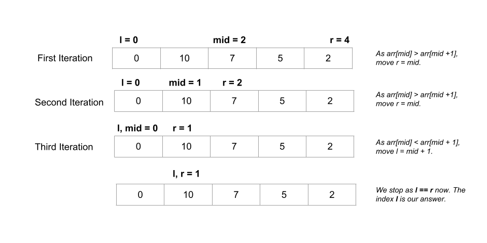

# 852. Peak Index in a Mountain Array

You are given an integer **mountain** array `arr` of length `n` where the values increase to a **peak element** and then decrease.

Return the index of the peak element.

Your task is to solve it in `O(log(n))` time complexity.

**Example 1:**

> **Input:** arr = \[0,1,0\]
>
> **Output:** 1

**Example 2:**

> **Input:** arr = \[0,2,1,0\]
>
> **Output:** 1

**Example 3:**

> **Input:** arr = \[0,10,5,2\]
>
> **Output:** 1

## Constraints

* `3 <= arr.length <= 105`
* `0 <= arr[i] <= 106`
* `arr` is **guaranteed** to be a mountain array.

## Topics

* `Array`
* `Binary Search`

## Similar Questions

Medium

[162. Find Peak Element](162_find_peak_element.md)

Hard
[1095. Find in Mountain Array]()
[1671. Minimum Number of Removals to Make Mountain Array]()

## Solution

### Overview

Given a mountain array `arr`, our task is to return the index `i` such that `arr[0] < arr[1] < ... < arr[i - 1] < arr[i] > arr[i + 1] > ... > arr[arr.length - 1]`. In simpler terms, all elements to the left are sorted ascending and all elements to the right are sorted descending.

### Approach 1: Linear Scan

#### Intuition

We are guaranteed to have an array of the form `arr[0] < arr[1] < ... < arr[i - 1] < arr[i] > arr[i + 1] > ... > arr[arr.length - 1]`. As our task is to find the index `i` (called the peak index of the mountain array), we can iterate over the array starting from the first element.

We can create a pointer `i` and set it to `0` to point to the first element. We compare the current element at index `i` with the next element at index `i + 1`. If `arr[i] < arr[i + 1]`, it means we haven't got the peak of the mountain yet. As a result, we increment `i` by `1` in this case to move to the next element. Otherwise, the first time we see `arr[i] > arr[i + 1]`, we return `i`.

#### Algorithm

1. Create an integer variable `i` and initialize it to `0`.
2. Using a while loop check if the current element pointed by `i` is smaller than the next element at index `i + 1`. If `arr[i] < arr[i + 1]`, increment `i` by `1`. Otherwise, if `arr[i] > arr[i + 1]`, we return `i`.

#### Implementation

```python
class Solution:
    def peakIndexInMountainArray(self, arr: List[int]) -> int:
        i = 0
        while arr[i] < arr[i + 1]:
            i += 1
        return i
```

#### Complexity Analysis

Here n is the length of `arr`.

* Time complexity: $O(n)$.

  * We are doing a linear scan and comparing adjacent elements until we get the peak of the mountain over the `arr` array. In the worst-case situation, the peak of the mountain could correspond to the second last element of `arr`, in which case we would take $O(n)$ time.
* Space complexity: $O(1)$.

  * We are not using any extra space other than an integer `i`, which takes up constant space.

* * *

### Approach 2: Binary Search

#### Intuition

In a mountain array with peak index `i`, any element at `index` with `index` less than `i` would obey `arr[index] < arr[index + 1]`. Furthermore, any `index` greater than or equal to `i` would follow the rule `arr[index] > arr[index + 1]` (and not obey `arr[index] < arr[index + 1]`).

A scenario like this where our task is to search for an element `i` from a given range `(l, r)` where all values smaller than `i` satisfy a certain condition and all values greater than or equal to `i` do not satisfy it (or vice-versa) can be solved optimally with a binary search algorithm. In binary search, we repeatedly divide the solution space where the answer could be in half until the range contains just one element.

Following the above discussion, we use binary search to solve this problem. We create an integer `l` and initialize it to the starting index `0`. We also create another integer variable `r` and set it to the last index of `arr`, i.e., `arr.length - 1`.

We get the middle of the range `mid = (l + r) / 2` and compare `arr[mid]` with the next element. If `arr[mid] < arr[mid + 1]`, we move to the upper half of the range by setting `l = mid + 1` as our peak index is definitely greater than `mid`. Otherwise, if `arr[mid] > arr[mid + 1]`, we move to the lower half of the range by setting `r = mid` as the peak index is either `mid` or some index smaller than `mid`.

The answer would be within the range `(l, r)` at any point. All the indices smaller than `l` are indices smaller than the peak index and all indices greater than `r` are indices greater than the peak index. We continue the search as long as `l < r`.

When `l == r`, `l` (or `r`) denotes the required peak index.

Here is a visual representation of an example to illustrate how it works:



#### Algorithm

1. Create two integer variables `l` and `r` to store the solution space of the problem. We initialize `l` with `0` and `r` to `arr.length - 1`.
2. While `l < r`:
    * Get the index of the middle element using `mid = (l + r) / 2`.
    * If `arr[mid] < arr[mid + 1]`, it indicates peak index is greater than `mid`. As a result, we move to upper half of the range by setting `l = mid + 1`.
    * Else, if `arr[mid] >= arr[mid + 1]`, it indicates that the peak index is either `mid` or some index smaller than `mid`. As a result, we move to the lower half of the range by setting `r = mid`.
3. Return `l` (or `r` as both are equal now).

#### Implementation

```python
class Solution:
    def peakIndexInMountainArray(self, arr: List[int]) -> int:
        l = 0
        r = len(arr) - 1
        while l < r:
            mid = (l + r) // 2
            if arr[mid] < arr[mid + 1]:
                l = mid + 1
            else:
                r = mid
        return l
```

#### Complexity Analysis

Here n is the length of `arr`.

* Time complexity: $O(\log n)$.

  * We perform $O(\log n)$ iterations using the binary search algorithm as the problem set is divided into half in each iteration.
* Space complexity: $O(1)$.

  * Except for a few variables `l`, `r`, and `mid` which take constant space each, we do not consume any other space.
