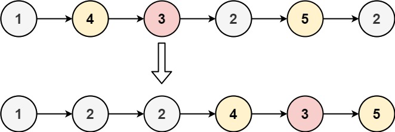

# 86. Partition List

Given the `head` of a linked list and a value `x`, partition it such that all nodes **less than** `x` come before nodes **greater than or equal** to `x`.

You should **preserve** the original relative order of the nodes in each of the two partitions.

**Example 1:**

**Input:** head = [1,4,3,2,5,2], x = 3
**Output:** [1,2,2,4,3,5]

**Example 2:**

**Input:** head = [2,1], x = 2
**Output:** [1,2]

## Constraints

- The number of nodes in the list is in the range `[0, 200]`.
- `-100 <= Node.val <= 100`
- `-200 <= x <= 200`

## Topics

- `Linked List`
- `Two Pointers`

## Similar Questions

Medium

- [2161. Partition Array According to Given Pivot](2161_partition_array_according_to_given_pivot.md)
