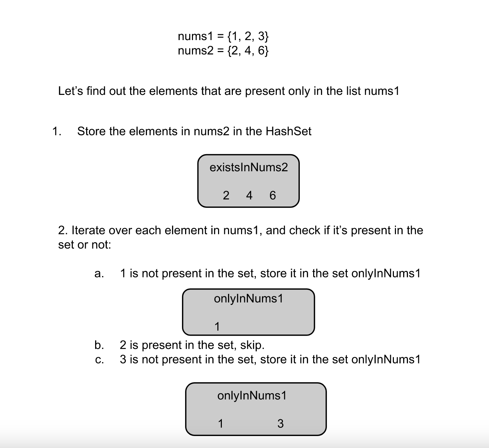

# 2215. Find the Difference of Two Arrays

Given two **0-indexed** integer arrays `nums1` and `nums2`, return _a list_ `answer` _of size_ `2` _where:_

* `answer[0]` _is a list of all **distinct** integers in_ `nums1` _which are **not** present in_ `nums2`_._
* `answer[1]` _is a list of all **distinct** integers in_ `nums2` _which are **not** present in_ `nums1`.

**Note** that the integers in the lists may be returned in **any** order.

**Example 1:**

> **Input:** nums1 = \[1,2,3\], nums2 = \[2,4,6\]
>
> **Output:** \[\[1,3\],\[4,6\]\]
>
> **Explanation:**
>
> For nums1, nums1\[1\] = 2 is present at index 0 of nums2, whereas nums1\[0\] = 1 and nums1\[2\] = 3 are not present in nums2. Therefore, answer\[0\] = \[1,3\].
>
> For nums2, nums2\[0\] = 2 is present at index 1 of nums1, whereas nums2\[1\] = 4 and nums2\[2\] = 6 are not present in nums2. Therefore, answer\[1\] = \[4,6\].

**Example 2:**

> **Input:** nums1 = \[1,2,3,3\], nums2 = \[1,1,2,2\]
>
> **Output:** \[\[3\],\[\]\]
>
> **Explanation:**
>
> For nums1, nums1\[2\] and nums1\[3\] are not present in nums2. Since nums1\[2\] == nums1\[3\], their value is only included once and answer\[0\] = \[3\].
>
> Every integer in nums2 is present in nums1. Therefore, answer\[1\] = \[\].

**Constraints:**

* `1 <= nums1.length, nums2.length <= 1000`
* `-1000 <= nums1[i], nums2[i] <= 1000`

## Topics

* `Array`
* `Hash Table`

## Hints

1. For each integer in nums1, check if it exists in nums2.
2. Do the same for each integer in nums2.

## Solution

### Overview

We are given two integer arrays, `nums1` and `nums2`, and need to return a list of two lists. The first list has the elements that are present only in `nums1`, while the second list has the elements that are present only in `nums2`.  

### Approach 1: Brute Force

**Intuition**

To find the elements in a list that are not present in another list, we can loop over every element in the first list and for each element we loop over the elements in the second list to check if it's present or not. If we find the element, we will not store it in the answer list; otherwise, we can store it.

This way, we will have to apply the above method twice once for the elements that are only in `nums1` and then again for the elements that are only present in `nums2`.

**Algorithm**

* `getElementsOnlyInFirstList` function:

  * Initialize an empty set `onlyInNums1` to store elements that are only in `nums1`.

  * Iterate over each element `num` in `nums1`:

    * Set a boolean flag `existInNums2` to `false`.
    * Iterate over each element `x` in `nums2`:
      * If `num` is found in `nums2` (i.e., `x == num`), set `existInNums2` to `true` and break the inner loop.
    * If `existInNums2` is still `false`, add `num` to the set `onlyInNums1` (i.e., `num` exists in `nums1` but not in `nums2`).
  * Convert `onlyInNums1` set to a list and return it.

* `findDifference` function:

  * Call `getElementsOnlyInFirstList(nums1, nums2)` to get elements only in `nums1` and store the result.
  * Call `getElementsOnlyInFirstList(nums2, nums1)` to get elements only in `nums2` and store the result.
  * Return a list of both results as a list of lists).
* The overall result contains two lists:

  * The first list contains elements in `nums1` that are not in `nums2`.
  * The second list contains elements in `nums2` that are not in `nums1`.

**Implementation**

```c++
class Solution {
public:
    // Returns the elements in the first arg nums1 that don't exist in the second arg nums2.
    vector<int> getElementsOnlyInFirstList(vector<int>& nums1, vector<int>& nums2) {
        unordered_set<int> onlyInNums1;
        
        // Iterate over each element in the list nums1.
        for (int num : nums1) {
            bool existInNums2 = false;
            // Check if num is present in the second arg nums2.
            for (int x : nums2) {
                if (x == num) {
                    existInNums2 = true;
                    break;
                }
            }
            
            if (!existInNums2) {
                onlyInNums1.insert(num);
            }
        }
        
        // Convert to vector.
        return vector<int> (onlyInNums1.begin(), onlyInNums1.end());
    }
    
    vector<vector<int>> findDifference(vector<int>& nums1, vector<int>& nums2) {
        return {getElementsOnlyInFirstList(nums1, nums2), getElementsOnlyInFirstList(nums2, nums1)};
    }
};
```

**Complexity Analysis**

Here, N is the length of list `nums1`, and M is the length of `nums2`.

* Time complexity: $O(N×M)$.

    The outer function `findDifference` calls the helper function `getElementsOnlyInFirstList` twice, once for `nums1` and once for `nums2`. For each element in `nums1`, we loop through all elements in `nums2` to check for existence, which results in a nested loop. The first loop runs for N iterations, and for each iteration, the inner loop runs for M iterations. This leads to a time complexity of $O(N×M)$.

    Additionally, the process of inserting elements into the set and converting the set into a list both take linear time, which is $O(N)$ for each. However, since N×M dominates, the overall time complexity remains $O(N×M)$.

    The second call to `getElementsOnlyInFirstList(nums2, nums1)` has similar behavior with M×N, but since multiplication is commutative, this still results in $O(N×M)$ overall.

* Space complexity: $O(N+M)$.

    The space complexity is primarily determined by the set and the list used to store unique elements. In the worst case, all elements of `nums1` and `nums2` are unique, leading to $O(N)$ space for the set in the first call and $O(M)$ space in the second call.

    Since both data structures exist separately for each call and are converted to list, the overall space usage is $O(N+M)$. The extra space for variables like `existInNums2` and loop counters is negligible, making the auxiliary space $O(1)$.

* * *

### Approach 2: HashSet

**Intuition**

Instead of iterating over each element in the second array to check if it exists in the list or not, we can store the elements in a HashSet. Then we can find if an element exists in the list or not in $O(1)$ time compared to $O(N)$ time in the previous approach.

In this approach, we follow the above intuition. To find the elements that only exist in `nums1`, we first store the elements in `nums2` in the HashSet. Then we iterate over each element in the list `nums1`, and for each element, we check if it's there in the HashSet; if yes, we skip the element; otherwise, we store it in the list `onlyInNums1`.



**Algorithm**

* `getElementsOnlyInFirstList` function:

  * Initialize an empty set `onlyInNums1` to store elements that are only in `nums1`.

  * Create a set `existsInNums2` to store all elements from `nums2`:

    * Iterate over each element `num` in `nums2` and add it to the set `existsInNums2`.
  * Iterate over each element `num` in `nums1`:

    * If `num` is not in `existsInNums2`, add it to the set `onlyInNums1` (i.e., `num` exists in `nums1` but not in `nums2`).
  * Convert `onlyInNums1` set to a list and return it.

* `findDifference` function:

  * Call `getElementsOnlyInFirstList(nums1, nums2)` to get elements only in `nums1` and store the result.
  * Call `getElementsOnlyInFirstList(nums2, nums1)` to get elements only in `nums2` and store the result.
  * Return a list of both results as a list of lists (i.e., `Arrays.asList`).
* The overall result contains two lists:

  * The first list contains elements in `nums1` that are not in `nums2`.
  * The second list contains elements in `nums2` that are not in `nums1`.

**Implementation**

```c++
class Solution {
public:
    // Returns the elements in the first arg nums1 that don't exist in the second arg nums2.
    vector<int> getElementsOnlyInFirstList(vector<int>& nums1, vector<int>& nums2) {
        unordered_set<int> onlyInNums1;
        
        // Store nums2 elements in an unordered set. 
        unordered_set<int> existsInNums2;
        for (int num : nums2) {
            existsInNums2.insert(num);
        }
        
        // Iterate over each element in the list nums1.
        for (int num : nums1) {
            if (existsInNums2.find(num) == existsInNums2.end()) {
                onlyInNums1.insert(num);
            }
        }
        
        // Convert to vector.
        return vector<int> (onlyInNums1.begin(), onlyInNums1.end());
    }
    
    vector<vector<int>> findDifference(vector<int>& nums1, vector<int>& nums2) {
        return {getElementsOnlyInFirstList(nums1, nums2), getElementsOnlyInFirstList(nums2, nums1)};
    }
};
```

**Complexity Analysis**

Here, N is the length of list `nums1`, and M is the length of `nums2`.

* Time complexity: $O(N+M)$.

    In this implementation, the function `getElementsOnlyInFirstList` is called twice. For each call, we first iterate over `nums2` to store its elements in a set. This operation takes $O(M)$ time, where M is the length of `nums2`. Inserting elements into a set is on average an $O(1)$ operation, so this step runs in $O(M)$ time.

    Next, we iterate over `nums1` and for each element, we check if it exists in the `existsInNums2` set. This lookup operation in a set also takes $O(1)$ on average, meaning the entire iteration over `nums1` takes $O(N)$ time.

    Since we perform these two operations (storing elements in a set and iterating over another set) for both `nums1` and `nums2`, the total time complexity is O(N+M) for each call to `getElementsOnlyInFirstList`. Thus, the overall time complexity is $O(N+M)$.

* Space complexity: $O(N+M)$.

    The space complexity is primarily determined by the set data structures used to store the elements of `nums2` and the unique elements from `nums1`. In the worst case, all elements of `nums1` and `nums2` are unique, meaning the set for `nums2` will take $O(M)$ space, and the set for the unique elements of `nums1` will take $O(N)$ space.

    Additionally, the list created to store the result takes up $O(N)$ space, as it needs to hold the elements from the set. Therefore, the total space complexity is $O(N+M)$, as the two sets and the lists are the main contributors to space usage.
