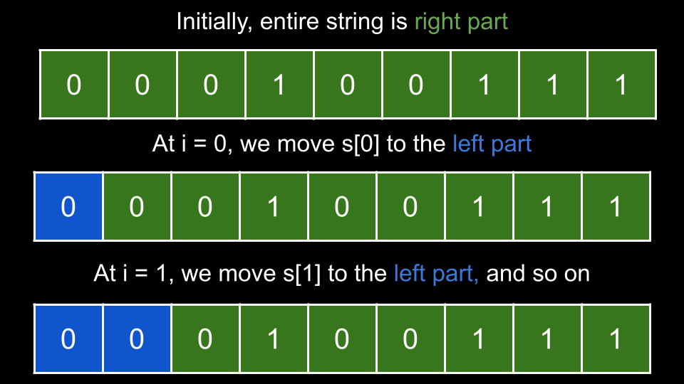

# 1422. Maximum Score After Splitting a String

Given a string `s` of zeros and ones, _return the maximum score after splitting the string into two **non-empty** substrings_ (i.e. **left** substring and **right** substring).

The score after splitting a string is the number of **zeros** in the **left** substring plus the number of **ones** in the **right** substring.

**Example 1:**

> **Input:** s = "011101"
>
> **Output:** 5
>
> **Explanation:**
>
> All possible ways of splitting s into two non-empty substrings are:
>
> left = "0" and right = "11101", score = 1 + 4 = 5
>
> left = "01" and right = "1101", score = 1 + 3 = 4
>
> left = "011" and right = "101", score = 1 + 2 = 3
>
> left = "0111" and right = "01", score = 1 + 1 = 2
>
> left = "01110" and right = "1", score = 2 + 1 = 3

**Example 2:**

> **Input:** s = "00111"
>
> **Output:** 5
>
> **Explanation:** When left = "00" and right = "111", we get the maximum score = 2 + 3 = 5

**Example 3:**

> **Input:** s = "1111"
>
> **Output:** 3

## Constraints

* `2 <= s.length <= 500`
* The string `s` consists of characters `'0'` and `'1'` only.

## Topics

* `String`
* `Prefix Sum`

## Hints

1. Precompute a prefix sum of ones ('1').
2. Iterate from left to right counting the number of zeros ('0'), then use the precomputed prefix sum for counting ones ('1'). Update the answer.

## Solution

### Approach 1: Brute Force

**Intuition**

In this problem, we need to make a "split" which involves separating the input into a left part and a right part.

To start, we can check every possible split. We will use an integer `i` to iterate over the string, where `i` represents the index of the final character in the left part.

For a given `i`, we iterate on the indices of `s` from `0` to `i` and count how many times `0` occurs. We then iterate on the indices from `i + 1` until the last index and count how many times `1` occurs. The sum of these counts represents the score for the current split, and we take the maximum of all scores.

Note that we cannot iterate `i` until the final index, but rather the second last index. If we were to iterate to the final index, the right part would be empty, which is not allowed by the problem.

**Algorithm**

1. Initialize the answer `ans = 0`.
2. Iterate `i` from `0` until `s.length - 1`:
    * Initialize the current score `curr = 0`.
    * Iterate `j` from `0` to `i`:
        * If `s[j] == '0'`, increment `curr`.
    * Iterate `j` from `i + 1` until `s.length`:
        * If `s[j] == '1'`, increment `curr`.
    * Update `ans` with `curr` if it is larger.
3. Return `ans`.

**Implementation**

```python
class Solution:
    def maxScore(self, s: str) -> int:
        ans = 0
        for i in range(len(s) - 1):
            curr = 0
            for j in range(i + 1):
                if s[j] == "0":
                    curr += 1
            for j in range(i + 1, len(s)):
                if s[j] == "1":
                    curr += 1
            ans = max(ans, curr)
        return ans
```

**Complexity Analysis**

Given n as the length of `nums`,

* Time complexity: $O(n^2)$

    We iterate `i` over $n-1$ indices. For each iteration, we have two iterations over `j`, traversing over a total of n indices. Thus, we iterate $O(n(n-1))=O(n^2)$ times.

* Space complexity: $O(1)$

    We aren't using any extra space other than a few integers.

### Approach 2: Count Left Zeros and Right Ones

**Intuition**

We can improve on the previous solution by noticing that between a split at index `i` and index `i + 1`, we are only changing one character (more specifically, moving it from the right substring to the left substring), leaving the other characters unchanged. Instead of iterating over the entire string for each split, we only need to check the moved character and calculate the score for the new split based on the previous split.

We start by counting how many times `1` occurs in `s`. Let's store this value in a variable `ones`. We will also have a variable `zeros` that represents how many `0` are in the left part. Initially, our variables `ones` and `zeros` are set as if the left part is empty and the right part is the entire string.

Now, we iterate `i` in the same manner as the previous approach: each index `i` represents the final index of the left part. At each iteration `i`, we remove `s[i]` from the right part and add it to the left part.



There are two possibilities for each index `i`:

* If `s[i] == '1'`: this `1` was in the right part, but it is now joining the left part. Thus, we lose `1` score since the right part is losing a `1`. Decrement `ones`.
* If `s[i] == '0'`, this `0` was in the right part, but it is now joining the left part. Thus, we gain `1` score since the left part is gaining a `0`. Increment `zeros`.

We update the answer with `zeros + ones` at each iteration if it is larger.

**Algorithm**

1. Initialize `ones` as the number of times `1` occurs in `s`.
2. Initialize `zeros = 0` and the answer `ans = 0`.
3. Iterate `i` from `0` until `s.length - 1`:
    * If `s[i] == '1'`, decrement `ones`.
    * Otherwise, increment `zeros`.
    * Update `ans` with `zeros + ones` if it is larger.
4. Return `ans`.

**Implementation**

```python
class Solution:
    def maxScore(self, s: str) -> int:
        ones = s.count("1")
        zeros = 0
        ans = 0

        for i in range(len(s) - 1):
            if s[i] == "1":
                ones -= 1
            else:
                zeros += 1

            ans = max(ans, zeros + ones)

        return ans
```

**Complexity Analysis**

Given n as the length of `nums`,

* Time complexity: $O(n)$

    We start by finding the frequency of `1`, which costs $O(n)$. Next, we iterate over the string once, performing $O(1)$ work at each iteration. Thus, our time complexity is $O(2n)=O(n)$.

* Space complexity: $O(1)$

    We aren't using any extra space other than a few integers.

### Approach 3: One Pass

**Intuition**

In the previous approach, we used two passes over the input string: once to calculate `ones`, and another time to calculate `ans`. We can further optimize the algorithm to only use one pass!

The answer to our problem is the maximum score for all valid splits, as represented by the following equation:

$score = Z_L ​+ O_R$​, where $Z_L$​ is the number of zeros in the left substring and $O_R$​ is the number of ones in the right substring.

We can express $O_R​$ as $O_T​−O_L$​, where $O_T​$ is the total number of ones in `s`, and $O_L$​ is the number of ones in the left substring.

Using the above expression, our first equation can be represented as:

$score = Z_L​+O_T​−O_L$​

In the above equation, $O_T$​ is a constant, we need to find the maximum value of $Z_L​−O_L$​ for all valid splits. Notice that both of these values depend solely on the left substring. Therefore, we don't need to consider the right substring, which saves the need for the first traversal in the previous solution.

In the code, we will use the variable `zeros` to represent $Z_L$​ and the variables `ones` to represent $O_L$​. As `zeros - ones` may be negative, we initialize an integer `best` to a very small value, like negative infinity. Here, `best` represents the largest value of `zeros - ones` we have seen so far.

We now iterate `i` in the same manner as the first two approaches: at each iteration, `i` represents the final index of the left part. On each iteration, we are adding `s[i]` to the left part. Thus, if `s[i] = '1'` we increment `ones`, otherwise `s[i] = '0'` and we increment `zeros`. Then, we update `best` with `zeros - ones` if it is larger.

Recall that we don't iterate `i` over the final index since it would mean having an empty right part. Once we are done iterating over `s`, we will check the final index to see if it is a `1`. If it is, we increment `ones`.

The reason we explicitly check the final index for `1` is that we want `ones` to represent $O_T$​ in the end, but when we calculate `ones`, we don't iterate over the last index, so we need to account for it. Now, we have `best` as the maximum of all $Z_L​−O_L$​ and `ones` represents $O_T$​, we can return `best + ones` as the answer.

**Algorithm**

1. Initialize `ones = 0`, `zeros = 0`, and `best` to a very small value like negative infinity.
2. Iterate `i` from `0` until `s.length - 1`:
    * If `s[i] == '1'`, increment `ones`.
    * Otherwise, increment `zeros`.
    * Update `best` with `zeros - ones` if it is larger.
3. If the final character of `s` is equal to `'1'`, increment `ones`.
4. Return `best + ones`.

**Implementation**

```python
class Solution:
    def maxScore(self, s: str) -> int:
        ones = 0
        zeros = 0
        best = -inf

        for i in range(len(s) - 1):
            if s[i] == "1":
                ones += 1
            else:
                zeros += 1

            best = max(best, zeros - ones)

        if s[-1] == "1":
            ones += 1

        return best + ones
```

**Complexity Analysis**

Given n as the length of `nums`,

* Time complexity: $O(n)$

    We make one pass over `nums`, performing $O(1)$ work at each iteration.

* Space complexity: $O(1)$

    We aren't using any extra space other than a few integers.
