# 2441. Largest Positive Integer That Exists With Its Negative

Given an integer array `nums` that **does not contain** any zeros, find **the largest positive** integer `k` such that `-k` also exists in the array.

Return _the positive integer_ `k`. If there is no such integer, return `-1`.

**Example 1:**

> **Input:** nums = \[-1,2,-3,3\]
>
> **Output:** 3
>
> **Explanation:** 3 is the only valid k we can find in the array.

**Example 2:**

> **Input:** nums = \[-1,10,6,7,-7,1\]
>
> **Output:** 7
>
> **Explanation:** Both 1 and 7 have their corresponding negative values in the array. 7 has a larger value.

**Example 3:**

> **Input:** nums = \[-10,8,6,7,-2,-3\]
>
> **Output:** -1
>
> **Explanation:** There is no a single valid k, we return -1.

## Constraints

* `1 <= nums.length <= 1000`
* `-1000 <= nums[i] <= 1000`
* `nums[i] != 0`

## Topics

* `Array`
* `Hash Table`
* `Two Pointers`
* `Sorting`

## Hints

1. What data structure can help you to determine if an element exists?
2. Would a hash table help?

## Solution

### Overview

We need to find the largest value `k` in the given array `nums` such that `-k` is also present in the array. In other words, we must find the largest positive number in the array that has a corresponding negative counterpart. If there is no positive number with a negative counterpart, return `-1`.

**Key Observations:**

* The `nums` array does not contain any zeros.
* The `nums` array has up to 1000 elements, and each element can range from −1000 to 1000

* * *

### Approach 1: Brute Force

#### Intuition

The brute force approach is to iterate through the input array using a nested loop, checking every possible pair of numbers to see if they are additive inverses. Additive inverses sum to zero. We can check this by comparing one number to the negation of the other number. If they are equal, the positive number is a possible `k` value. We update the answer if this number is larger than the current answer.

#### Algorithm

* Initialize `ans` to -1 to ensure it starts lower than any valid absolute value, so the first encountered valid absolute value will always replace it.
* For each `i` in `nums`, iterate through the `nums` array again for `j`.
  * If `i` is equal to the negation of `j`, update `ans` to `max(ans, abs(i))`.
* Return `ans`.

#### Implementation

```python
class Solution:
    def findMaxK(self, nums: List[int]) -> int:
        ans = -1
        for i in nums:
            for j in nums:
                # If there exists a number j such that i is the negative of j
                if i == -j:
                    # Update the answer to the maximum of current ans and absolute value of i
                    ans = max(ans, abs(i))
        return ans
```

#### Complexity Analysis

Let n be the size of the `nums` array.

* Time complexity: $O(n2)$

    The nested loops iterate through the entire array for each element, resulting in a quadratic time complexity.

    Let's consider the worst-case scenario where nums has 1000 elements, and each element can range from −1000 to 1000

  * The outer loop will run 1000 times (once for each element).
  * For each iteration of the outer loop, the inner loop will run another 1000 times (once for each element).
  * This results in a total of 1000⋅1000\=1,000,000 iterations of the inner loop.

    For this problem, the brute force solution is accepted.

* Space complexity: $O(1)$

    The algorithm only uses a constant amount of extra space to store the answer.

* * *

### Approach 2: Two Pointer

#### Intuition

The key observation is that if a pair of numbers sum to 0, they must have opposite signs.

This suggests that we can sort the input array first and then use a two-pointer approach to find pairs of numbers that sum to 0.

Since the array is sorted, `nums[lo]` begins as the largest negative number in the array, and `nums[hi]` starts as the largest positive value in the array. If `-nums[lo]` and `nums[hi]` are equal, then we have found the largest pair of numbers with opposite signs that sum to 0, so `nums[hi]` is the answer.

This is similar to the classic two sum problem, but with the added constraint that the numbers must have opposite signs.

The following is an illustration demonstrating the two pointer approach:

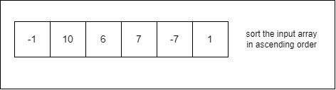
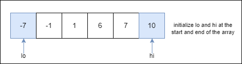
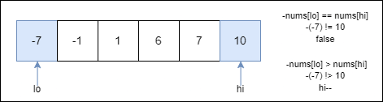
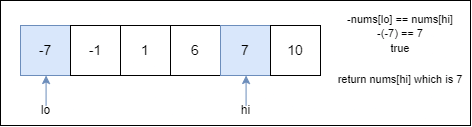

#### Algorithm

* Sort the `nums` array in ascending order.
* Initialize `lo` to 0 and `hi` to the last index of the `nums` array.
* While `lo` is less than `hi`:
  * If `-nums[lo]` is equal to `nums[hi]`, return `nums[hi]`.
  * If `-nums[lo]` is greater than `nums[hi]`, increment `lo`.
  * If `-nums[lo]` is less than `nums[hi]`, decrement `hi`.
* If the loop completes without finding a matching pair, return -1.

#### Implementation

```python
class Solution:
    def findMaxK(self, nums: List[int]) -> int:
        # Sort the input list in ascending order
        nums.sort()
        lo = 0
        hi = len(nums) - 1
        while lo < hi:
            # If the negation of the element at lo is equal to the element at hi
            if -nums[lo] == nums[hi]:
                return nums[hi]
            # If the negation of element at lo is greater than element at hi
            elif -nums[lo] > nums[hi]:
                lo += 1
            # If the negation of element at lo is smaller than element at hi
            else:
                hi -= 1
        return -1
```

#### Complexity Analysis

Let n be the size of the `nums` array.

* Time complexity: $O(n \cdot \log n)$

    The sorting step takes $O(n \cdot \log n)$ time. The while loop will process each element in `nums` at most once, so this step takes $O(n)$. The sorting step dominates the time complexity, with the two-pointer step being linear.

* Space complexity: $O(n)$ or $O(\log n)$

    The algorithm only uses a constant amount of extra space to store the pointers.

    Some extra space is used when we sort the `nums` in place. The space complexity of the sorting algorithms depends on the programming language.

  * In Python, the `sort` method sorts a list using the Timsort algorithm which is a combination of Merge Sort and Insertion Sort and has $O(n)$ additional space.
  * In C++, the `sort()` function is implemented as a hybrid of Quick Sort, Heap Sort, and Insertion Sort, with a worst-case space complexity of $O(\log n)$.
  * In Java, `Arrays.sort()` is implemented using a variant of the Quick Sort algorithm which has a space complexity of $O(\log n)$ for sorting two arrays.

* * *

### Approach 3: Two Pass Hash Set

#### Intuition

In the brute force approach, we sacrificed runtime to find the solution. The key insight from this approach was to use nested loops to search for the negative versions of positive numbers. If we search for values without traversing the entire range, we can eliminate the need for the nested loop. This implies the necessity of a data structure with constant lookup time ($O(1)$), allowing us to store all negative numbers encountered during the first pass.

The idea is to use a hash set to store all negative numbers encountered in the first pass. Then, in the second pass, we can check if the negatives of the positive numbers exist in the hash set and update the maximum value accordingly.

#### Algorithm

* Initialize a hash set named `neg` to store negative numbers.
* Iterate over `nums` and add negative numbers to `neg`.
* Initialize `ans` to -1.
* Iterate over `nums`:
  * For each `num`, check if `num` is greater than `ans` and if `-num` exists in the `neg` set.
  * If the condition is true, update `ans` to `num`.
* Return `ans`.

#### Implementation

```python
class Solution:
    def findMaxK(self, nums: List[int]) -> int:
        # Initialize a set to store negative numbers
        neg = set()
        # Loop through the numbers and insert negative numbers into the set
        for num in nums:
            if num < 0:
                neg.add(num)
        ans = -1
        for num in nums:
            # If current number is greater than ans and its negation exists in the set
            if num > ans and -num in neg:
                ans = num
        return ans
```

#### Complexity Analysis

Let n be the size of the `nums` array.

* Time complexity: $O(n)$

    The algorithm uses a single loop to identify the negative numbers and another loop to find the maximum value `k`. The use of the hash set allows for constant-time lookups in the average case.

* Space complexity: $O(n)$

    The hash set used to store the negative numbers requires linear space.

* * *

### Approach 4: One Pass Hash Set

#### Intuition

In the previous hash set approach, we used two passes: one to populate the `neg` set with negative numbers and another to determine the maximum value `k`.

However, we can optimize this process to achieve the same goal with just a single iteration through the array. During this iteration, we can simultaneously check for the existence of the negation of each encountered number and update the maximum value `k` accordingly. This optimization allows us to reduce our approach to a one-pass solution.

The following is an illustration demonstrating the one pass hash set approach:

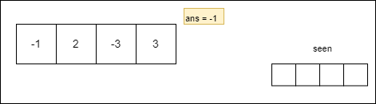
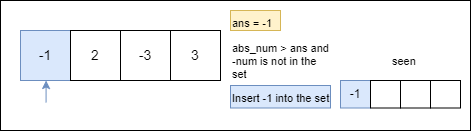
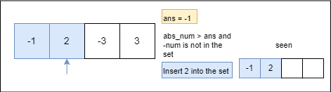
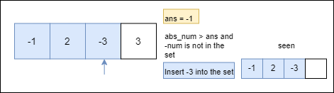
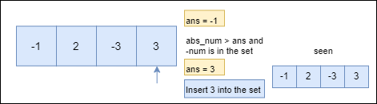

#### Algorithm

* Initialize `ans` to -1.
* Initialize a hash set `seen` to store the absolute values of the numbers.
* Iterate over `nums`:
  * For each `num`, get the absolute value `abs_num`.
  * Check if `abs_num` is greater than `ans` and if the negation of `num` is present in the `seen` set.
  * If the condition is true, update `ans` to `abs_num`.
  * Add the current `num` to the `seen` set.
* Return `ans`

#### Implementation

```python
class Solution:
    def findMaxK(self, nums: List[int]) -> int:
        ans = -1
        # A set to store seen numbers
        seen = set()
        for num in nums:
            abs_num = abs(num)
            # If the absolute value is greater than the current maximum and its negation is seen
            if abs_num > ans and -num in seen:
                ans = abs_num
            seen.add(num)  # Insert the current number into the set
        return ans
```

#### Complexity Analysis

Let n be the size of the `nums` array.

* Time complexity: $O(n)$

    The algorithm uses a single loop to process the array. Hash set lookups take constant time in the average case.

* Space complexity: $O(n)$

    The hash set used to store the encountered numbers requires linear space.

* * *

### Approach 5: One Pass Bitset

#### Intuition

Given the range −1000<=nums\[i\]<=1000, we can track all numbers encountered using a bitset. For instance, we can set a bit if the number is negative and leave it unset if the number is positive.

To accomplish this, we use a bitset of size 1024 to denote the existence of negative numbers encountered during the traversal of the input array. Initially, all bits in the bitset are set to `0`. Then, as we iterate through the array, we set the bit corresponding to the index of the negative value to `1` whenever a negative number is encountered.

In the subsequent pass, we check if the negatives of the positive numbers are present in the bitset. This operation is highly efficient, as bitsets offer constant-time access to individual bits.

This would be a two-pass solution, but we can further optimize it to use a single pass.

We'll track both negative and positive numbers encountered using a bitset array size of 2048. Each index in the bitset corresponds to a number in the range \[−1024,1023\]. According to the constraints, this range covers the possible values in the input array.

During the traversal, we will check if the absolute value of the current number is greater than the current maximum value and if the negation of the current number has been encountered before. If both conditions are met, we will update `ans` to the absolute value of the current number.

After checking the conditions, we need to mark the current number as encountered by setting the corresponding bit in the seen bitset. This can be done by marking the `num + 1024` value as `true`. Adding 1024 to `num` maps both positive and negative numbers to non-negative indices in the bitset. This ensures that the indices used in the bitset cover the entire range of possible values encountered in the input array.

The following is an illustration demonstrating the one pass bitset approach:


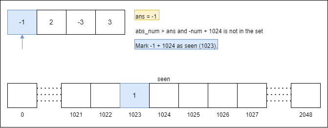
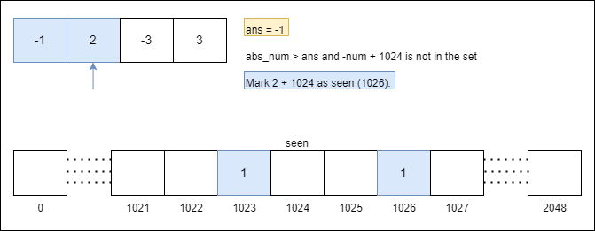
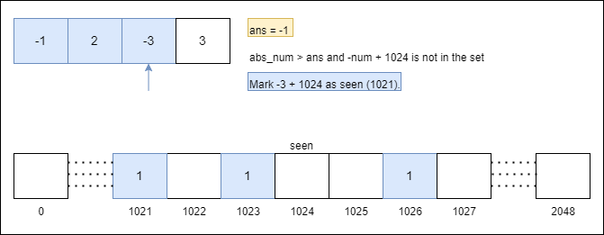
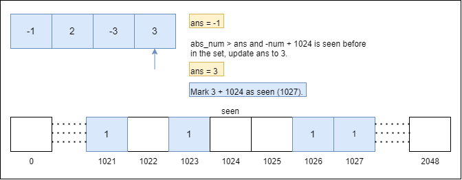

#### Algorithm

* Initialize `ans` to -1.
* Initialize a bitset array of size 2048 named as `seen` to store the presence of the numbers (shifted by 1024 to handle negative numbers).
* Iterate over `nums`:
  * For each `num`, get the absolute value `abs_num`.
  * Check if `abs_num` is greater than `ans` and if the negation of `num` (shifted by 1024) is present in the `seen` bitset.
  * If the condition is true, update `ans = abs_num`.
  * Set the bit at index `num + 1024` in the `seen` bitset to true.
* Return `ans`.

#### Implementation

> Note: We have used a Set instead of the bitset function from the Bitset library. As of 9/9/2024, the Bitset library is available for installation from [Python's official repository (Link)](https://pypi.org/project/bitsets/0.4/) but is not supported in the LeetCode environment. The implementation code below simulates similar logic to what would be achieved with the bitset function, using a Set instead.

```python
from bitarray import bitarray
from typing import List

class Solution:
    def findMaxK(self, nums: List[int]) -> int:
        ans = -1
        # Initialize a bitarray to keep track of seen numbers
        bitset = bitarray(2 * 1024)  # Sufficient size for positive and negative offsets
        bitset.setall(False)  # Set all bits to False initially
    for num in nums:
        abs_num = abs(num)
        bit_index = abs_num + 1024  # Offset for handling both positive and negative values
        # If the absolute value is greater than the current answer
        # and its negation was seen before, update the answer
        if abs_num > ans and bitset[-num + 1024]:
            ans = abs_num
        # Mark the current number as seen
        bitset[bit_index] = True
    return ans
```

> As the Bitset library is not supported in the LeetCode environment, so the above dropdown implementation is provided for illustrative purposes.

```python
class Solution:
    def findMaxK(self, nums: List[int]) -> int:
        ans = -1
        # Initialize a set to keep track of seen numbers
        seen = set()
        for num in nums:
            abs_num = abs(num)
            # If the absolute value is greater than the current answer
            # and its negation was seen before,
            # update the answer
            if abs_num > ans and -num + 1024 in seen:
                ans = abs_num
            # Mark the current number as seen
            seen.add(num + 1024)
        return ans
```

#### Complexity Analysis

Let n be the size of the `nums` array and m be the size of the range of input values.

* Time complexity: $O(n)$

    The algorithm uses a single loop to process the array and perform constant-time lookups in the bitset.

* Space complexity: $O(m)$

    The bitset is size 2048 in our implementation, so it can store data about 2000 numbers, as the constraints specify that the numbers will be between −1000 and 1000.
