# 3217. Delete Nodes From Linked List Present in Array

## [Description](https://leetcode.com/problems/delete-nodes-from-linked-list-present-in-array)

## Solution

```go
// Ключевая идея:
// Для массив с числами предполагается "большим", следовательно нужно улучшить
// скорость поиска по значению. В данном используем HashSet. Затем просто
// проходимся в цикле и удаляем по условию.
func modifiedList(nums []int, head *ListNode) *ListNode {
    // Инициализируем HashSet с памятью, предполагаемой для размещения всех
    // значений массива nums
    nm := make(map[int]struct{}, len(nums))
    for i := range nums {
        nm[nums[i]] = struct{}{}
    }
    // Инициализируем Dummy Node с указателем на head списка
    dummy := &ListNode{Next: head}
    // Инициализируем указатель на предыдущий узел
    prev := dummy
    // используем head как указатель на текущий узел
    // условие цикла: пока указатель на текущий узел не nil.
    for head != nil {
        // если в HashSet есть значение из узла - делаем разрыв связи
        if _, ok := nm[head.Val]; ok {
            prev.Next = head.Next
        } else {
            // иначе двигаемся дальше
            prev = prev.Next
        }
        // всегда двигаем указатель на текущий узел дальше
        head = head.Next
    }
    return dummy.Next
}
```

## Visualization

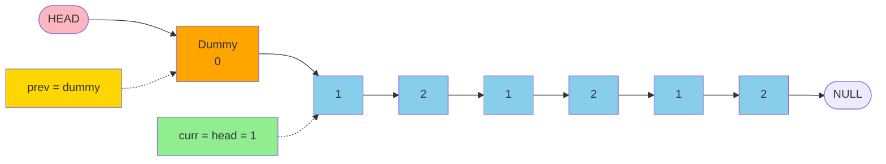

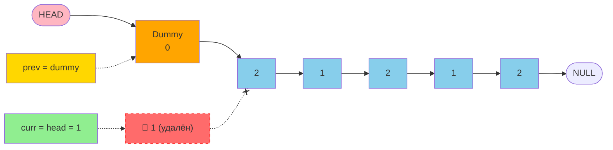

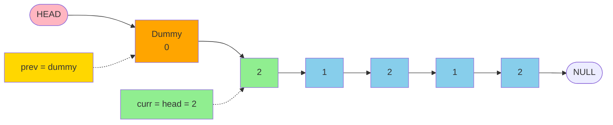

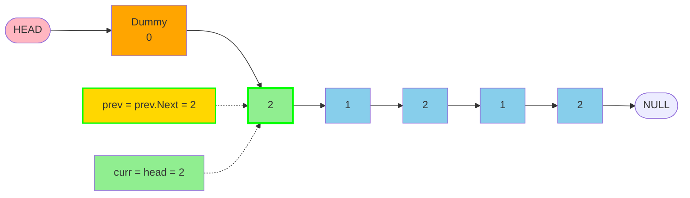

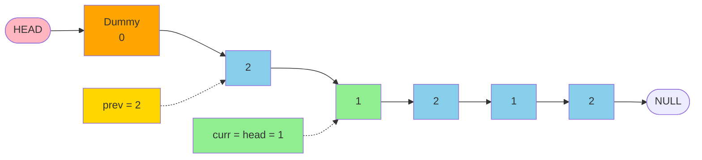

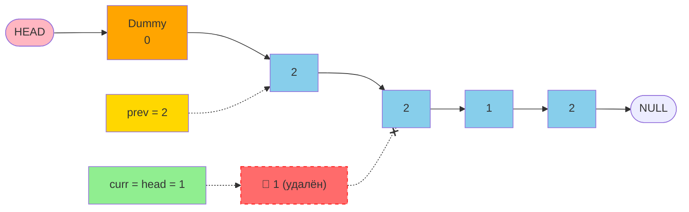

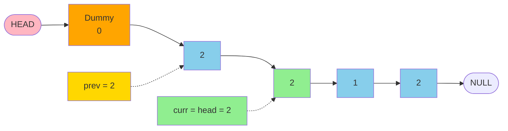

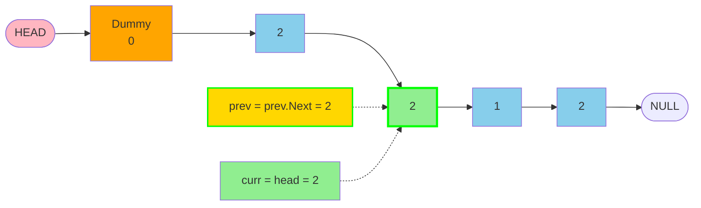

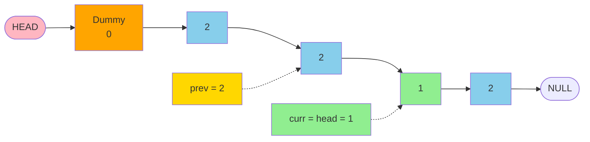

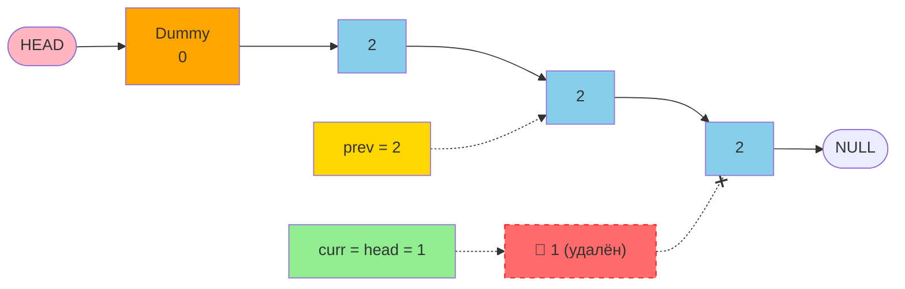

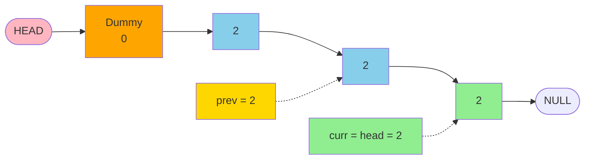

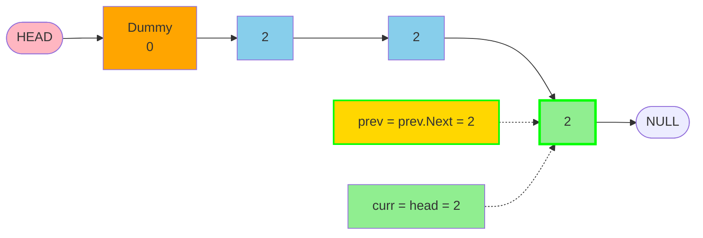

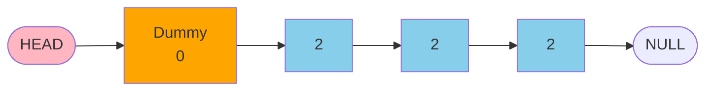
